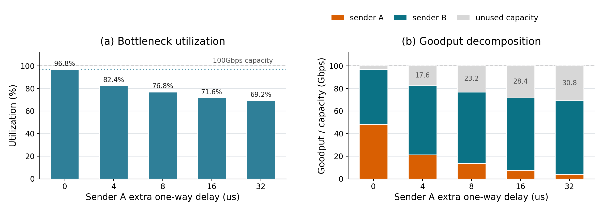
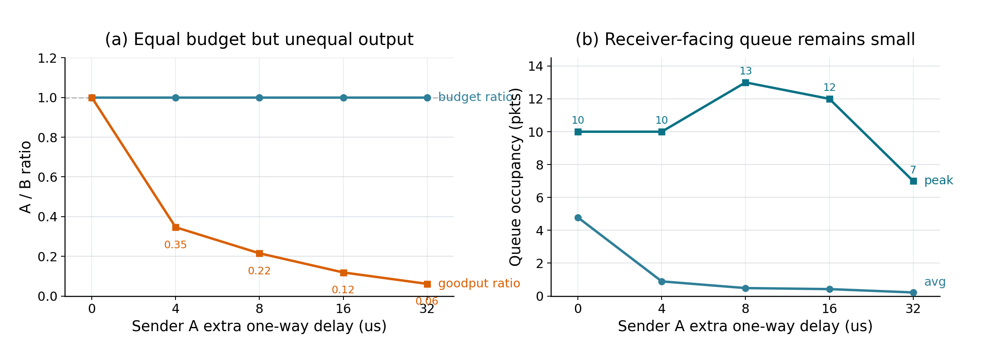

# RTT 异构下的 credit 周转低效场景写法

本文档用于把 RTT 异构下的 credit 周转低效实验写进论文或报告。它说明场景、问题、实验设置、结果解释、可直接使用的论文段落，以及写作时需要避免的过度结论。

## 1. 场景描述

本实验构造了一个两发送者、一接收者的 RTT 异构场景。拓扑包含两个 sender、两个交换机和一个 receiver：

```text
sender A -- switch0 -- switch1 -- receiver
sender B ----------- switch1 -- receiver
```

其中 sender A 和 receiver 不在同一个交换机下，A 的数据需要经过 `switch0 -> switch1` 的跨交换机链路；sender B 和 receiver 在同一个交换机 `switch1` 下。A 和 B 最终都通过 `switch1 -> receiver` 这条 receiver-facing bottleneck link 到达接收端。

实验通过增加 `switch0 -> switch1` 链路的额外传播时延来拉大 sender A 的 RTT，而 sender B 的 RTT 保持较短。这样可以隔离观察：当接收方对 A/B 近似均匀分配 credit budget 时，长 RTT sender A 获得的 credit 是否会因为周转慢而产生更低的数据吞吐，从而造成 credit 资源低效占用。

## 2. 要说明的问题

SIRD/Homa 的 receiver-driven credit 机制会在接收端为多个发送者分配 scheduled data 的发送信用。这个机制在 RTT 接近的情况下可以较好地协调多个 sender，但在 RTT 异构时可能出现一个问题：

> 如果接收方按 sender 近似均匀分配 credit，而不考虑不同 sender 的 RTT，分配给长 RTT sender 的 credit 会更慢返回数据。相同数量的 credit 在单位时间内产生的数据更少，造成 credit 资源的低效占用。短 RTT sender 即使可以更快周转，也无法完全补足被长 RTT sender 占用的 credit 空间，最终导致 receiver-facing bottleneck link 用不满。

因此，本实验要回答三个问题：

1. receiver 是否仍然给 A/B 近似均匀的 per-sender credit budget？
2. 随着 A 的 RTT 增加，A 的 goodput 是否显著下降？
3. B 是否能够完全补偿 A 的吞吐下降，使最后一跳仍保持满利用？

只有当下面三个现象同时出现时，才能支撑本实验的结论：

```text
sender budget A/B ~= 1.0
sender A goodput 随 RTT 增大而下降
aggregate goodput < receiver bottleneck capacity，且 receiver queue 不高
```

这说明最后一跳链路用不满不是因为拥塞排队，而是因为 credit 分配在 RTT 异构下产生了低效周转。

## 3. 实验设计

实验使用当前 RTT sweep 配置，默认参数专门用于 RTT 异构实验：

```text
host link rate = 100 Gbps
inter-switch link rate = 100 Gbps
receiver bottleneck link = 100 Gbps
base per-link delay = 1 us
BDP_PKTS = 33.32
message size = 10 MB
backlog depth = 8 messages per sender
long-path extra delay = 0, 4, 8, 16, 32 us
```

两个 sender 都是 backlogged flow，持续向同一个 receiver 发送大消息。`long-path extra delay=0us` 是 RTT 同构近似基线；`4/8/16/32us` 是逐步增加 sender A RTT 的异构配置。

主要观测指标：

- `sender_budget_ratio_a_to_b`：receiver 分配给 A/B 的 per-sender credit budget 比例；
- `sender_a_goodput_gbps` 和 `sender_b_goodput_gbps`：A/B 各自完成数据形成的 goodput；
- `aggregate_goodput_gbps` 和 `aggregate_utilization`：最后一跳链路实际利用率；
- `receiver_queue_avg_pkts` 和 `receiver_queue_peak_pkts`：receiver-facing queue 是否有拥塞积压。

结果来源为 RTT 异构 sweep 的汇总输出，正文写作时主要使用表格中的 goodput、utilization、sender budget ratio 和 receiver queue 指标。

## 4. 实验结果

结果汇总如下：

| A 额外单向时延 | Aggregate goodput | Utilization | A goodput | B goodput | Sender budget A/B | Avg receiver queue | Peak receiver queue |
|---:|---:|---:|---:|---:|---:|---:|---:|
| 0 us | 96.8 Gbps | 96.8% | 48.4 Gbps | 48.4 Gbps | 1.0 | 4.782 pkt | 10 pkt |
| 4 us | 82.4 Gbps | 82.4% | 21.2 Gbps | 61.2 Gbps | 1.0 | 0.891 pkt | 10 pkt |
| 8 us | 76.8 Gbps | 76.8% | 13.6 Gbps | 63.2 Gbps | 1.0 | 0.483 pkt | 13 pkt |
| 16 us | 71.6 Gbps | 71.6% | 7.6 Gbps | 64.0 Gbps | 1.0 | 0.421 pkt | 12 pkt |
| 32 us | 69.2 Gbps | 69.2% | 4.0 Gbps | 65.2 Gbps | 1.0 | 0.218 pkt | 7 pkt |

这组结果有三个关键信号。

第一，receiver 对 A/B 的 `senderBudgetPkts` 始终相同，`sender budget A/B = 1.0`。这说明 receiver 的 per-sender credit budget 分配没有随着 RTT 异构而倾斜，长 RTT sender A 和短 RTT sender B 获得了近似相同的 credit budget。

第二，随着 A 的额外 RTT 增加，A 的 goodput 快速下降。`extra delay=0us` 时，A 和 B 各自约 `48.4Gbps`，整体接近公平并且最后一跳利用率约 `96.8%`。当 A 的额外单向时延增加到 `32us` 时，A 的 goodput 下降到 `4.0Gbps`，而 B 只能提高到 `65.2Gbps`。

第三，aggregate goodput 明显低于 `100Gbps` receiver bottleneck，但 receiver-facing queue 的平均值仅为 `0.218-4.782` packets，峰值也只有 `7-13` packets。队列始终处于很小范围内，说明最后一跳不是因为拥塞排队而受限；相反，最后一跳没有足够数据可发，表现为 under-utilization。

## 5. 图和读图说明

本节给出适合论文正文展示的新版组合图。这个实验的论点不是单纯“长 RTT sender 变慢”，而是：receiver 仍然近似均分 credit budget，但长 RTT sender 的单位时间产出下降，短 RTT sender 又无法完全补偿，最终使 receiver-facing bottleneck 出现 under-utilization。为了让图直接服务这个论点，正文建议使用两张组合图。

### 5.1 瓶颈利用率与容量分解



这张图是正文主结果图，包含两个子图：

- 左图展示 receiver bottleneck utilization 随 sender A 额外单向时延增加而下降；
- 右图将 `100Gbps` receiver bottleneck capacity 拆分为 sender A goodput、sender B goodput 和 unused capacity。

图中的关键读法是：

- `0us` 时，A 和 B 各约 `48.4Gbps`，链路利用率达到 `96.8%`；
- 随着 A 的额外单向时延增加，A goodput 快速下降；
- B 的 goodput 会提高，但最高只到约 `65.2Gbps`，无法完全补偿 A 的吞吐损失；
- `32us` 时，A 只有 `4.0Gbps`，aggregate utilization 下降到 `69.2%`，unused capacity 扩大到约 `30.8Gbps`。

这张图能说明的核心问题是：瓶颈链路的损失不是因为总需求不足。两个 sender 都是 backlogged flow，B 也确实提高了发送贡献；但是由于 receiver-side credit budget 仍然近似均匀，B 无法获得足够额外 credit 来填满最后一跳。

论文图注可以写：

> RTT 异构下的 receiver bottleneck 利用率与容量分解。随着 sender A 的额外单向时延增加，链路利用率由 `96.8%` 降至 `69.2%`；sender B 虽然提高了 goodput，但无法完全补偿 sender A 的吞吐下降，导致 unused capacity 持续扩大。

### 5.2 机制证据：均分 credit、吞吐失衡与极小队列



这张图用于解释主结果背后的机制。它不再单独展示一条 `sender budget A/B = 1.0` 的直线，而是把 budget ratio 与 A/B goodput ratio 放在同一张图中对比，并同时展示 receiver-facing queue。

左图的核心含义是：

- sender budget A/B 在所有 RTT 配置下都保持为 `1.0`，说明 receiver 对 A/B 的 credit budget 始终近似均分；
- A/B goodput ratio 却随着 A 的额外单向时延增加从 `1.0` 下降到约 `0.06`；
- 因此，均分 credit 并没有转化为均等吞吐，相同 credit 在长 RTT 路径上的单位时间产出明显降低。

右图的核心含义是：

- receiver-facing queue 的平均值仅为 `0.218-4.782` packets；
- peak queue 也只有 `7-13` packets；
- 因此，aggregate goodput 下降不是由拥塞排队、queue buildup 或 receiver-side overflow 造成的，而是 receiver bottleneck under-utilization。

论文图注可以写：

> RTT 异构下的机制证据：receiver 对 A/B 维持近似均匀的 credit budget，但 A/B goodput ratio 随 RTT 差异快速下降；与此同时，receiver-facing queue 始终很小，说明性能下降来自 credit 周转低效，而不是排队拥塞。

### 5.3 推荐图组合

如果论文空间有限，建议只放上述两张图：

1. `figure_4_3_rtt_utilization_goodput.png`
   - 作为主结果图，说明 RTT 异构导致瓶颈利用率下降，并展示 A/B goodput 与 unused capacity 的容量分解。

2. `figure_4_4_rtt_mechanism.png`
   - 作为机制证据图，说明 receiver 仍均分 credit，但吞吐贡献失衡，同时 receiver-facing queue 始终很小。

不建议在正文中单独放预算比例图。它本身只是一条常数直线，单独展示信息量很低；更合理的用法是把它和 A/B goodput ratio 放在一起，形成“均分 credit 但产出失衡”的对照。

## 6. 如何解释结果

这个实验最重要的解释链条是：

```text
receiver 近似均匀分配 A/B credit budget
        ↓
A 的 RTT 更长，credit 周转时间更长
        ↓
A 单位时间内用同样 credit 产生的数据更少
        ↓
B 虽然 RTT 短，但无法完全获得 A 低效占用的 credit 空间
        ↓
aggregate goodput 下降，receiver-facing bottleneck link 用不满
```

结果中最有力的对照是 `0us` 和 `32us`：

- `0us`：A/B goodput 都是 `48.4Gbps`，总 goodput `96.8Gbps`，接近打满最后一跳；
- `32us`：A goodput 只有 `4.0Gbps`，B goodput 提高到 `65.2Gbps`，但总 goodput 只有 `69.2Gbps`；
- 两者的 `sender budget A/B` 都是 `1.0`；
- 两者的 receiver queue 都很小，未形成拥塞排队。

这说明：问题不是 receiver bottleneck 过载，也不是 B 无数据可发，而是 credit 分配没有充分考虑 RTT 异构，导致给 A 的 credit 在单位时间内产生较低吞吐，形成低效占用。

## 7. 可以直接使用的论文段落

### 中文版本

我们进一步构造了一个 RTT 异构场景，用于分析 receiver-driven credit 在不同 RTT sender 之间分配 credit 时的效率问题。该场景包含两个发送端、两个交换机和一个接收端。sender A 位于远端交换机下，需要经过跨交换机链路到达接收端；sender B 与接收端位于同一交换机下。两个 sender 共享 `switch1 -> receiver` 这条 `100Gbps` receiver-facing bottleneck link。实验通过增加 sender A 路径上的额外传播时延来构造 RTT 异构，而 sender B 保持短 RTT。

实验结果显示，receiver 对两个 sender 的 per-sender credit budget 始终近似相同，`sender budget A/B` 保持为 `1.0`。然而，随着 sender A 的额外单向时延从 `0us` 增加到 `32us`，A 的 goodput 从 `48.4Gbps` 下降到 `4.0Gbps`。短 RTT 的 sender B 虽然从 `48.4Gbps` 提升到 `65.2Gbps`，但无法完全补偿 A 的吞吐下降，aggregate goodput 从 `96.8Gbps` 下降到 `69.2Gbps`。

同时，receiver-facing queue 的平均值仅为 `0.218-4.782` packets，峰值也只有 `7-13` packets，说明该场景下最后一跳链路并非因为拥塞排队受限，而是由于没有足够 scheduled data 到达而未被充分利用。这表明，在 RTT 异构场景中，均匀的 receiver-side credit budget 分配可能导致 credit 资源低效占用：分配给长 RTT sender 的 credit 周转更慢，单位时间内产生的数据更少，而短 RTT sender 又无法完全获得这部分低效占用的 credit 空间，最终造成 receiver bottleneck under-utilization。

### English version, if needed

We construct an RTT-heterogeneous scenario to study the efficiency of receiver-driven credit allocation across senders with different RTTs. The topology contains two senders, two switches, and one receiver. Sender A is attached to a remote switch and reaches the receiver through an inter-switch link, while sender B is co-located with the receiver under the same switch. Both senders share a `100Gbps` receiver-facing bottleneck link. We increase the extra propagation delay on sender A's path to create RTT heterogeneity while keeping sender B on a short-RTT path.

The results show that the receiver allocates approximately equal per-sender credit budgets to A and B, with the sender budget ratio remaining at `1.0`. However, as sender A's extra one-way delay increases from `0us` to `32us`, A's goodput drops from `48.4Gbps` to `4.0Gbps`. Sender B increases its goodput from `48.4Gbps` to `65.2Gbps`, but it cannot fully compensate for A's throughput loss. As a result, aggregate goodput drops from `96.8Gbps` to `69.2Gbps`.

The receiver-facing queue remains small throughout the sweep, indicating that the bottleneck is not limited by congestion or queue buildup. Instead, the receiver bottleneck is under-utilized because credit assigned to the long-RTT sender turns over slowly and produces less data per unit time. This demonstrates that RTT-oblivious, uniform receiver-side credit allocation can inefficiently occupy credit resources and reduce bottleneck utilization under RTT heterogeneity.

## 8. 结论写法

可以把结论写成以下三点：

1. 在 RTT 同构时，两个 sender 各自获得约一半吞吐，receiver bottleneck 接近满利用。

2. 在 RTT 异构时，receiver 仍然给 A/B 近似相同的 sender credit budget，但长 RTT sender A 的 credit 周转更慢，goodput 显著下降。

3. 短 RTT sender B 不能完全补偿 A 的吞吐下降，导致 aggregate goodput 明显低于 receiver bottleneck capacity；同时 receiver queue 始终很小，说明这是 under-utilization，而不是拥塞。

一句话结论：

> RTT 异构会使均匀 receiver-side credit allocation 产生低效占用：长 RTT sender 持有的 credit 周转慢，单位时间内贡献的数据少，最终导致共享 receiver bottleneck link 用不满。

## 9. 写作注意事项

- 不要只说“长 RTT sender 吞吐更低”。这只是现象的一部分，真正要强调的是：receiver budget 仍然均匀，但 aggregate utilization 下降且 receiver queue 始终很小。
- 不要把该结果描述为 packet loss 或 queue overflow 问题。这里的关键是 under-utilization。
- `sender budget A/B = 1.0` 是支撑“均匀分配”的关键证据。
- receiver queue 始终很小，是支撑“不是拥塞”的关键证据。
- `aggregate utilization` 从 `96.8%` 降到 `69.2%` 是支撑“最后一跳用不满”的关键证据。
- 论文正文建议使用新版组合图：一张展示 bottleneck utilization 与 goodput decomposition，另一张展示 budget ratio、A/B goodput ratio 与 receiver queue。
