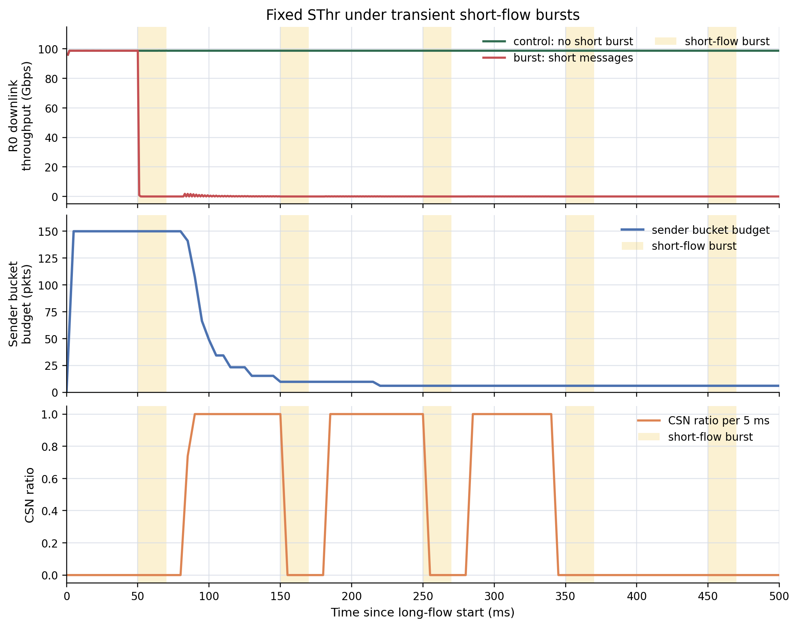
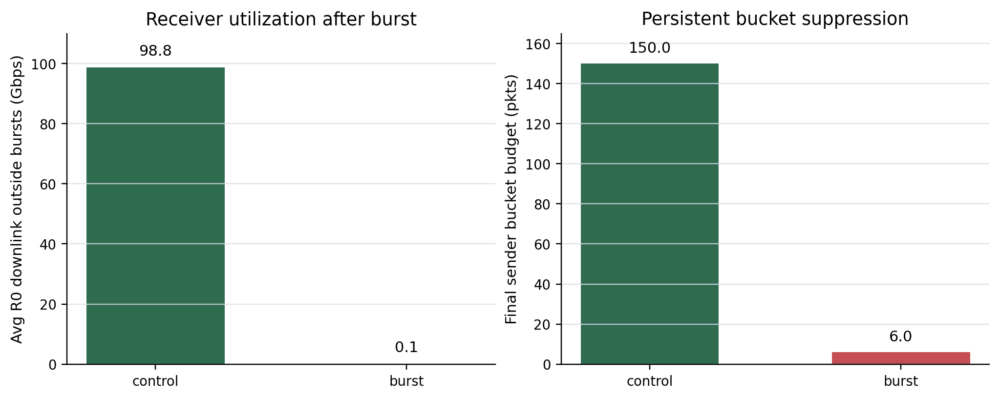

# 固定 SThr 在短流突发下的恢复滞后问题

本文档用于描述一个新的问题场景：固定发送端拥塞阈值 `SThr` 在动态负载下可能把短暂的发送端上行竞争误判为长期 sender bottleneck，从而把接收端对该 sender 的 per-sender credit bucket 压得过低。短流突发结束后，sender 和 receiver 明明都有可用带宽，但 bucket 只能通过 additive increase 缓慢恢复，导致 receiver downlink 长时间利用率不足。

实验代码为：

```text
scratch/bad4_sthr_burst.cc
```

本次服务器结果目录为：

```text
/mnt/nasDisk_ds3617/sird/bad4/bad4_sthr_burst_fast_20260512_170757
```

本地同步结果目录为：

```text
outputs/bad4/bad4_sthr_burst_fast_20260512_170757
```

## 1. 场景描述

实验构造一个单交换机拓扑，所有主机通过 `100Gbps` 链路连接到同一个交换机：

```text
                +-------- R0  长消息接收方
                |
S0 发送方 ---- switch ---- R1
                |          R2
                |          ...
                +-------- R8  短消息接收方
```

其中 `S0 -> R0` 是一条长期存在的大消息流。该流的消息大小为 `10MB`，超过 SIRD 的 unscheduled threshold，因此需要 receiver `R0` 持续向 `S0` 发 scheduled credit。理想情况下，`R0` 应该通过 credit 精确控制 `S0` 的 DATA 注入，使自己的下行链路保持高利用率。

与此同时，`S0` 会周期性向 `R1..R8` 发送短消息 burst。短消息大小为 `64KB`，低于本实验中的 SIRD unscheduled threshold，因此这些短消息不需要等待 scheduled credit，可以直接占用 `S0` 的上行链路。在 burst 期间，`S0` 的 uplink 被短流抢占，`S0 -> R0` 的 scheduled DATA 返回速率下降。

这个场景要验证的问题是：

> 固定 `SThr` 是否会把短流 burst 造成的临时 credit 积压解释为 sender 长期拥塞，从而触发 receiver 侧 per-sender bucket 的 multiplicative decrease，并在 burst 结束后造成恢复滞后？

## 2. 实验设计

本实验使用一组对照：

| Case | 含义 |
|---|---|
| `control` | 只有 `S0 -> R0` 大消息流，没有短流 burst |
| `burst` | `S0 -> R0` 大消息流 + `S0 -> R1..R8` 周期性短流 burst |

主要参数如下：

| 参数 | 取值 | 说明 |
|---|---:|---|
| link rate | `100Gbps` | 所有 host-switch 链路速率 |
| BDP | `150 packets` | Homa/SIRD BDP 参数 |
| SIRD credit budget | `225 packets` | `1.5 * BDP` |
| SIRD unscheduled threshold | `150 packets` | `1.0 * BDP` |
| SThr | `75 packets` | `0.5 * BDP` |
| long message size | `10MB` | `S0 -> R0` 大消息 |
| short message size | `64KB` | 短流 burst 消息，低于 unscheduled threshold |
| short receivers | `8` | `R1..R8` |
| burst duration | `20ms` | 每轮短流突发持续时间 |
| burst period | `100ms` | 每轮短流突发开始间隔 |
| first burst offset | `50ms` | 相对大流开始时间 |
| simulation duration | `0.5s` | 本次快速验证窗口 |

实验观测三个指标：

1. `R0 downlink throughput`：直接从链路 `MacRx` 统计 `R0` 下行吞吐，用于判断接收端链路是否被打满。
2. `sender bucket budget`：从 SIRD grant decision trace 采样 receiver 对 `S0` 的 per-sender bucket。
3. `CSN ratio`：统计每个采样窗口内 receiver 看到的 sender-side CSN 比例，用于判断是否触发了 sender-side multiplicative decrease。

## 3. 实验结果

### 3.1 时间序列结果



图 1 展示了 `control` 和 `burst` 两组实验的时间序列。黄色阴影表示短流 burst 发生的时间段。

上半部分是 `R0` 下行吞吐。`control` 中，`R0` 下行基本维持在接近 `100Gbps` 的水平，说明单独的大消息流可以通过 scheduled credit 持续填满接收端下行链路。`burst` 中，短流突发出现后，`R0` 下行吞吐迅速下降，并且在 burst 间隔期也没有恢复。

中间部分是 receiver 对 `S0` 的 per-sender bucket。`burst` 开始前，bucket 约为 `150 packets`；短流 burst 触发 CSN 后，bucket 被 multiplicative decrease 压低到约 `6 packets`，并在本次观测窗口内没有恢复到可用水平。

下半部分是 CSN ratio。短流 burst 后，CSN ratio 多次达到 `1.0`，说明 receiver 观察到 `S0` 的 sender-side credit backlog，并据此持续降低 sender bucket。这里的问题在于：这个 backlog 的根因是短流临时抢占了 `S0` uplink，而不是 `S0 -> R0` 这条长流永久失去发送能力。

### 3.2 汇总对比



图 2 将关键结果压缩成两个对比指标。

| 指标 | control | burst |
|---|---:|---:|
| burst 后非突发窗口内 `R0` 平均下行吞吐 | `98.77Gbps` | `0.063Gbps` |
| 最终 sender bucket budget | `150.00 packets` | `6.03 packets` |
| burst case 中出现 CSN 的采样窗口 | - | `40 / 101` |

结果说明：没有短流 burst 时，`R0` 几乎可以持续打满下行链路；加入短流 burst 后，`R0` 在非 burst 时间段也无法恢复吞吐。也就是说，问题不是短流占用链路的那 `20ms` 本身，而是短流结束后 bucket 已经被压低，后续 credit 发放受限。

## 4. 结论

这组实验支持你提出的问题场景：

> 固定 `SThr` 无法区分短暂发送端上行竞争和长期 sender bottleneck。短流 burst 会使 sender-side credit backlog 短时间超过固定阈值，触发 CSN。receiver 据此对该 sender 的 per-sender bucket 执行 multiplicative decrease。短流结束后，sender uplink 恢复可用，但 bucket 只能 additive increase 缓慢恢复，导致 receiver downlink 长时间利用率不足。

从控制逻辑上看，这个问题的本质是“反馈语义过粗”。当前 CSN 只表达 sender 侧 credit backlog 超过 `SThr`，但没有表达 backlog 的持续时间、burst 是否已经结束、sender 当前实际发送能力是否恢复。因此 receiver 会把临时扰动当作长期瓶颈处理。

这个场景和 RTT 异构场景不同。RTT 异构问题中，credit 周转慢来自路径时延；本场景中，credit 周转慢来自 sender uplink 被短流临时抢占。两者都会表现为 credit 回收慢，但根因不同。因此它可以作为另一个独立的 bad case。

## 5. 论文中可以这样写

可以把这一节标题写成：

```text
固定发送端阈值在短流突发下的恢复滞后
```

或更偏论文风格：

```text
Transient Sender Contention under a Fixed CSN Threshold
```

正文可以写：

> 为进一步分析固定发送端阈值在动态工作负载下的局限性，本文构造了一个短流突发与长流共存的发送端竞争场景。发送方 `S0` 持续向接收方 `R0` 发送一个需要 scheduled credit 的大消息流；同时，`S0` 周期性向其他多个接收方发送无需调度的短消息突发。短流突发期间，`S0` 的上行链路被短消息占用，使得 `S0` 向 `R0` 返回 scheduled DATA 的速率下降。由于 receiver 只能通过固定 `SThr` 判断 sender-side credit backlog，短暂的上行竞争会触发 CSN，并使 `R0` 对 `S0` 的 per-sender bucket 发生乘性下降。

结果段可以写：

> 实验结果表明，在没有短流突发的 `control` 场景中，`R0` 下行吞吐稳定在接近 `100Gbps`，sender bucket 保持在约 `150 packets`。加入短流 burst 后，`R0` 在非突发时间段的平均下行吞吐下降到约 `0.063Gbps`，而 receiver 对 `S0` 的 sender bucket 被压低到约 `6 packets`。这说明短流结束后，瓶颈并不再是 `S0` 的瞬时上行竞争，而是 receiver 侧 bucket 恢复过慢导致 credit 发放不足。

结论段可以写：

> 因此，固定 `SThr` 会把短时 sender uplink contention 和长期 sender bottleneck 混为同一种反馈事件处理。在突发性短流反复出现时，sender bucket 会被周期性压低，并通过较慢的 additive increase 恢复，从而造成长期接收端利用率损失。这说明发送端反馈阈值需要具备一定的动态适配能力，或者 receiver 侧需要结合 burst 持续时间、CSN 持续性和链路恢复信号区分瞬时扰动与稳定瓶颈。

## 6. 写作时需要注意

这组实验目前是一个快速验证版，结论可以说“证明该问题场景在当前实现中存在”，但不应直接声称“所有短流突发都会导致该程度的吞吐下降”。本次参数比较激进，短流 burst 对 sender uplink 的冲击很强，因此它更适合作为机制验证图。

如果要作为最终论文中的强结果，建议后续再补一个参数 sweep：

1. `shortBurstDurationUs = 5ms / 10ms / 20ms`
2. `shortReceiverCount = 2 / 4 / 8`
3. `SThr = 0.25BDP / 0.5BDP / 1.0BDP`
4. `SirdSenderAiStep = 1 / 2 / 4`

这样可以说明问题不是单点参数偶然触发，而是固定 `SThr` 在动态 sender contention 下的系统性脆弱性。
