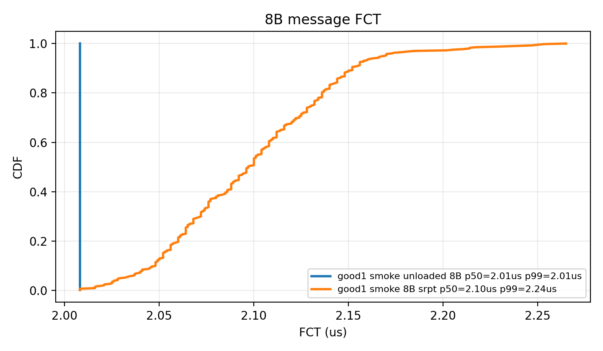
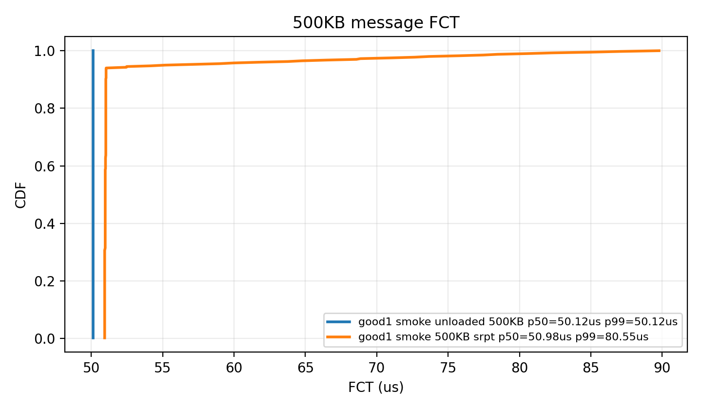
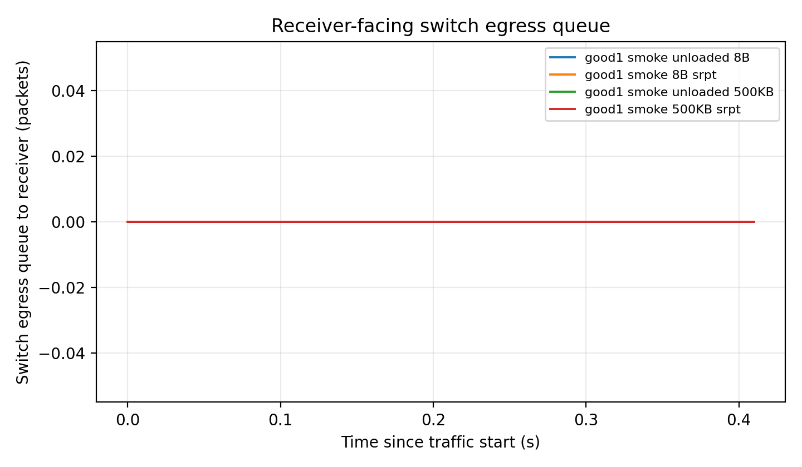
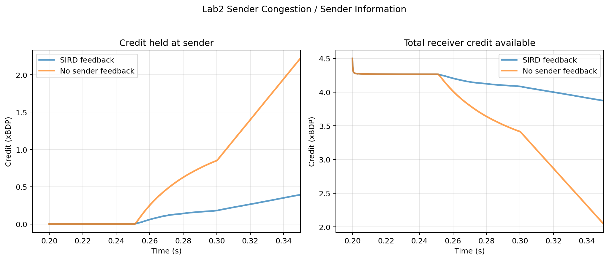
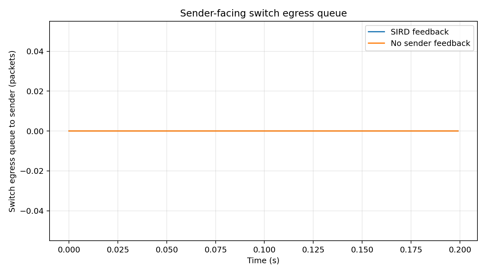
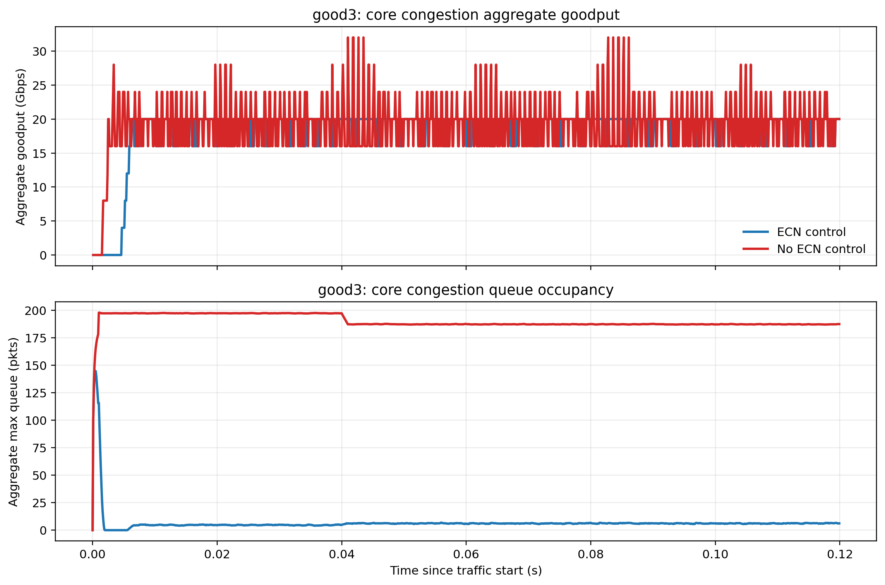
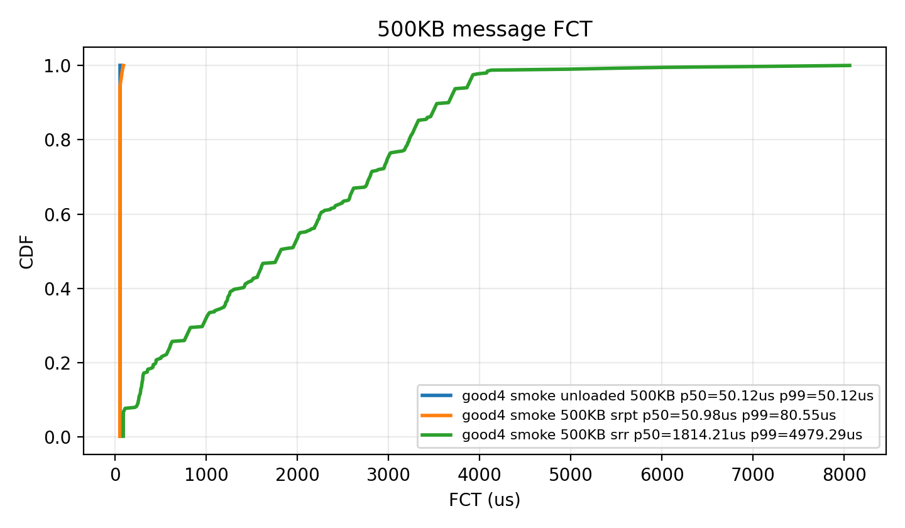

# SIRD 正向场景实验报告

本文档汇总 `good1` 至 `good4` 四个新建场景的 smoke 结果。四个场景均为独立 `scratch/good*.cc`，没有通过 `#include` 复用 `lab1.cc`、`lab2.cc` 或 `sim1.cc`。实验运行在服务器 `r75251`，结果目录位于 `/mnt/nasDisk_ds3617/sird/`。

当前结果的定位是“论文图示与机制验证”：它能说明对应机制是否按预期工作；若作为最终论文数据，建议再用 `fast/full` profile 增加持续时间和样本量。

## good1：接收端下行瓶颈

### 场景与问题

`good1` 构造典型 incast：6 个长消息发送端和 1 个 probe 发送端汇聚到同一个接收端。接收端下行链路成为瓶颈。该场景要说明的问题是：receiver-driven credit 是否能限制下行注入速率，并避免短消息被长消息排队淹没。

对照方式：

- `unloaded`：无背景长流，作为基线；
- `incast + SRPT`：开启背景长流，接收端使用剩余字节优先的调度。

服务器结果目录：

`/mnt/nasDisk_ds3617/sird/good1/20260430/good1_independent_smoke_20260430_133046`

### 图 1：8B 短消息完成时间

这张图比较空载和 incast 下 8B probe 消息的 FCT CDF。结果显示 8B 消息在 incast 下仍接近空载基线：p50 从 `2.008us` 增加到 `2.097us`，p99 为 `2.238us`。这说明短消息没有被背景长流显著拖慢。

### 图 2：500KB 消息完成时间

这张图比较 500KB probe 消息在空载和 incast 下的完成时间。incast 下 p50 为 `50.980us`，接近空载的 `50.117us`；p99 上升到 `80.554us`。这说明 receiver bottleneck 存在扰动，但 SRPT/credit 机制仍能让中等消息及时推进。

### 图 3：接收端队列时间序列

这张图用于解释“为什么时延没有失控”。如果接收端队列没有长期持续增长，就说明接收端 credit 控制把注入速率限制在下行链路可承受范围内，而不是靠交换机队列堆积来吸收 incast。

### 可写入论文的结论

在接收端下行瓶颈场景中，SIRD/Homa 风格的 receiver-driven credit 能够把数据注入限制在接收端可服务范围内。结合 SRPT 调度后，小消息和剩余字节较少的消息不会被长消息批量淹没，因此 8B 与 500KB probe 的完成时间均接近空载基线。

## good2：发送端上行瓶颈

### 场景与问题

`good2` 构造单发送端、多接收端的上行瓶颈场景。一个发送端向 3 个接收端持续发送长消息，多个接收端可能同时给同一个发送端发 credit。该场景要说明的问题是：如果发送端已经因为上行链路受限而无法及时消耗 credit，接收端是否能通过 sender-side feedback 减少对该发送端的无效授权。

对照方式：

- `feedback`：启用发送端 credit 积压反馈；
- `no_feedback`：提高 `S_Thr` 并关闭 sender-side AIMD，使接收端近似看不到发送端积压。

服务器结果目录：

`/mnt/nasDisk_ds3617/sird/good2/20260430/good2_independent_smoke_20260430_133046`

### 图 4：发送端 credit 积压动态

这张图比较开启和关闭 sender feedback 后，发送端持有但尚未消耗的 credit。`feedback` 的平均 sender-held credit 为 `0.133 xBDP`，最终为 `0.393 xBDP`；`no_feedback` 的平均值升至 `0.679 xBDP`，最终达到 `2.221 xBDP`。

### 图 5：发送端交换机出口队列

这张图用于辅助判断上行侧是否出现瓶颈和排队。它和 credit 动态图一起说明：问题不是接收端缺少 credit，而是 credit 被分配到了无法及时发送数据的发送端。

### 可写入论文的结论

在发送端上行瓶颈场景中，关闭 sender feedback 会导致多个接收端持续向同一个受限发送端发放 credit，从而造成 credit 在发送端积压。启用 SIRD 的发送端反馈后，接收端能够识别这类低效占用，并减少对该发送端的后续授权，使 credit 更容易留给其他可用发送路径。

## good3：核心链路过载

### 场景与问题

`good3` 构造 4 个发送端、4 个接收端和两台交换机组成的 dumbbell 拓扑。所有流量经过两台交换机之间的共享 core link。该场景要说明的问题是：当核心链路成为共享瓶颈时，SIRD 是否能利用 ECN 反馈降低对应 sender 的 credit 上限，从而限制核心队列积压。

对照方式：

- `control`：启用 `SirdQueueDisc` ECN 标记和 receiver-side ECN AIMD；
- `no_ecn`：把 ECN 标记阈值抬高到近乎不触发，并关闭 ECN AIMD。

注意：为了让 ns-3 的 `SirdQueueDisc` 真正承载 backlog，本场景将 core 设备队列设为 `1p`，使排队发生在 queue disc 中，而不是被 `PointToPointNetDevice` 的 TxQueue 吸收。

服务器结果目录：

`/mnt/nasDisk_ds3617/sird/good3/20260430/good3_independent_smoke_qdisc_20260430_133834`

### 图 6：核心吞吐与核心队列

上半部分比较 aggregate goodput，下半部分比较 core queue。两组吞吐几乎相同：`control` 为 `19.419Gbps`，`no_ecn` 为 `19.459Gbps`。但队列差异很明显：`control` 的 p95 max queue 为 `9` packets，`no_ecn` 为 `199` packets。

### 可写入论文的结论

在核心共享链路过载场景中，ECN 控制没有明显牺牲吞吐，却显著降低了核心队列积压。该结果说明 SIRD 的 core-side 控制环路能够把核心链路 ECN 标记转化为接收端 credit 上限调整，从而限制共享核心链路上的排队。

## good4：混合消息大小

### 场景与问题

`good4` 使用独立实现的混合消息大小场景，强调短消息 fast path 和中等消息调度策略。场景同时观察 8B 极短消息和 500KB 消息；500KB 消息进一步比较 SRPT 与 SRR。

对照方式：

- `unloaded`：无背景长流；
- `incast + SRPT`：接收端按剩余字节优先；
- `incast + SRR`：接收端按发送端轮询，更强调 sender 间公平。

服务器结果目录：

`/mnt/nasDisk_ds3617/sird/good4/20260430/good4_independent_smoke_20260430_133046`

### 图 7：8B 短消息完成时间

这张图说明极短消息能否沿 unscheduled fast path 快速完成。结果与 good1 一致：8B 消息在 incast 下 p50 为 `2.097us`，接近空载的 `2.008us`。

### 图 8：500KB 消息在 SRPT 与 SRR 下的完成时间

这张图是 good4 的核心。500KB 消息在 `incast + SRPT` 下 p50 为 `50.980us`、p99 为 `80.554us`；在 `incast + SRR` 下 p50 升至 `1814.207us`、p99 升至 `4979.290us`。这说明混合负载下，调度策略对非极短消息的完成时间影响很大。

### 可写入论文的结论

对于 8B 极短消息，unscheduled fast path 使其在混合负载中仍接近空载完成时间。对于 500KB 消息，receiver-side scheduling policy 决定其能否及时完成：SRPT 优先推进剩余字节少的消息，显著优于按 sender 轮询的 SRR。

## 总结

四个场景分别覆盖 SIRD 需要解决的四类问题：接收端下行瓶颈、发送端上行瓶颈、核心链路过载和混合消息大小。当前 smoke 结果已经能支撑机制层面的说明：

- `good1`：credit 控制接收端注入，短消息和中等消息没有被 incast 背景流淹没；
- `good2`：sender feedback 降低发送端 credit 低效积压；
- `good3`：ECN 控制在近似相同吞吐下显著压低核心队列；
- `good4`：短消息 fast path 与 SRPT 调度共同改善混合负载下的完成时间。

如果用于最终论文图，建议将四个场景切到 `fast` 或 `full` profile，并固定随机种子、增加样本量后重新生成图。
