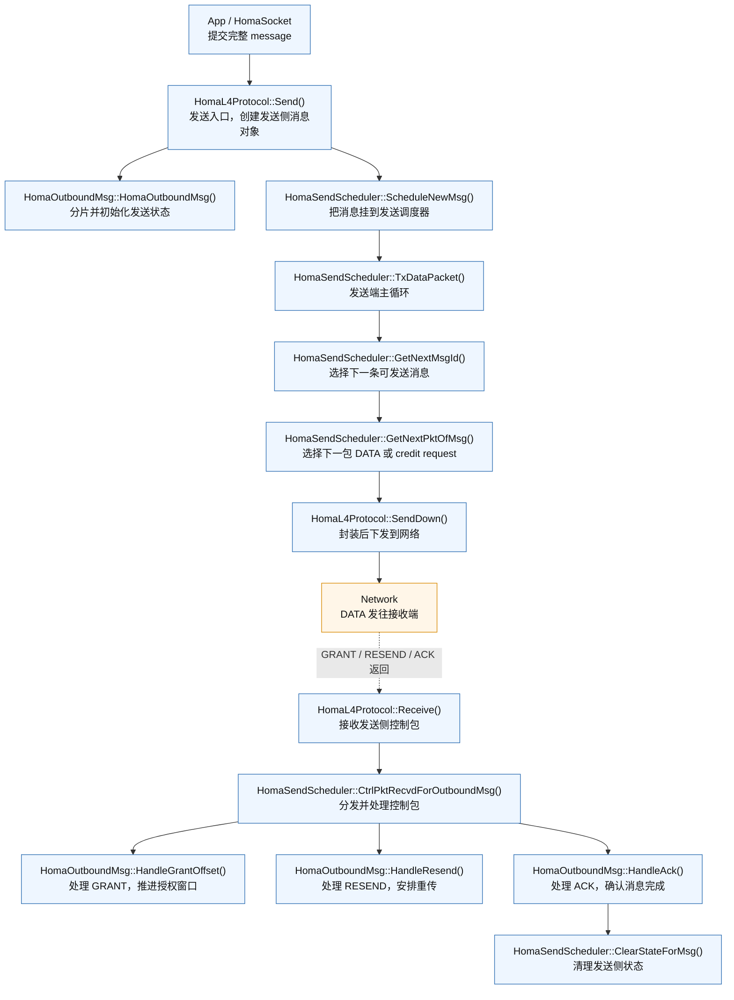
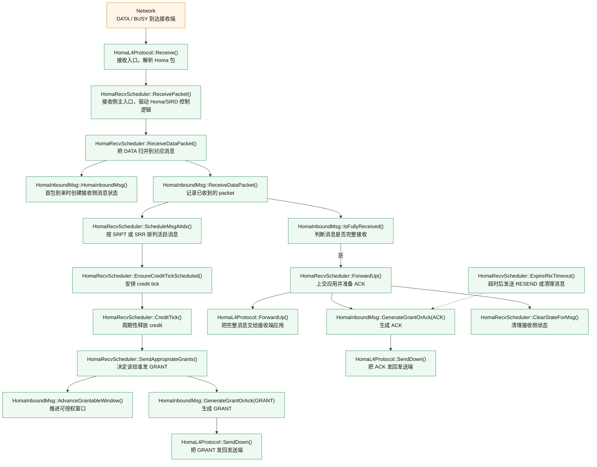

# Homa/SIRD 发送端与接收端函数调用图（精简版）

这份文档给出一版更适合讲解的调用图。

特点：

- 只保留主函数调用链；
- 每个节点只写 `函数名` 和 `作用`；
- 不展开“修改了哪些变量”；
- 重点突出 `DATA`、`GRANT/ACK/RESEND` 和 `SIRD credit` 这三条逻辑线。

## 1. 发送端函数调用图

### 发送端怎么讲

1. 应用先调用 `HomaL4Protocol::Send()` 发一个完整 message。
2. 发送端创建 `HomaOutboundMsg`，完成分片和初始发送状态设置。
3. `HomaSendScheduler` 把消息纳入调度，然后在 `TxDataPacket()` 主循环里持续挑选“哪条消息、哪一个包”可以发。
4. 接收端回来的 `GRANT / RESEND / ACK` 会重新进入发送端控制路径。
5. 其中最关键的是 `HandleGrantOffset()`，因为它决定发送端拿到多少新的 scheduled 发送机会。

## 2. 接收端函数调用图

### 接收端怎么讲

1. 所有 `DATA / BUSY` 都从 `HomaL4Protocol::Receive()` 进入接收端。
2. `HomaRecvScheduler::ReceivePacket()` 是接收端主入口，它既处理普通 Homa 收包，也驱动 SIRD 的 credit 控制。
3. `ReceiveDataPacket()` 负责把 packet 归到对应 message 上，`ScheduleMsgAtIdx()` 负责决定活跃消息的服务顺序。
4. `CreditTick()` 和 `SendAppropriateGrants()` 组成 receiver-driven credit 的核心闭环。
5. 消息收齐后，接收端把完整 message 上交应用，同时生成 `ACK`；如果长期没有进展，则由 `ExpireRtxTimeout()` 触发 `RESEND`。

## 3. 最适合口头讲解的主线

如果你在答辩或汇报里只想讲最核心的 6 句话，可以直接按下面这条线讲：

1. 发送端先把一个完整 message 交给 `HomaL4Protocol::Send()`。
2. 发送调度器负责决定当前能发哪条消息、哪一个 packet。
3. 接收端收到数据后，把 packet 归并到对应 message，并维护活跃消息顺序。
4. 接收端通过 `CreditTick()` 周期性触发调度，再由 `SendAppropriateGrants()` 决定下一次把 credit 给谁。
5. 发送端收到 `GRANT` 后，在 `HandleGrantOffset()` 中推进授权窗口，然后继续发送 scheduled data。
6. 消息完成后，接收端回 `ACK`，发送端和接收端分别清理各自状态。

## 4. 论文里可以怎么引用

图名建议：

- `图 X Homa/SIRD 发送端主调用流程（精简版）`
- `图 Y Homa/SIRD 接收端主调用流程（精简版）`

正文一句话可以写：

> 图 X 和图 Y 展示了 Homa/SIRD 在发送端和接收端的主函数调用链。发送端围绕消息创建、发送调度和控制包处理展开；接收端围绕消息重组、credit 分配和完成确认展开。
