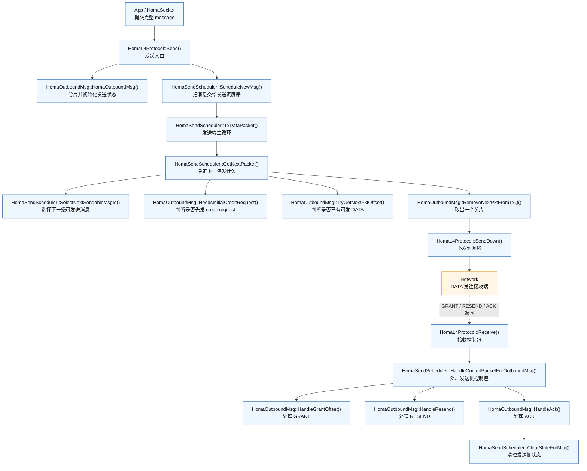
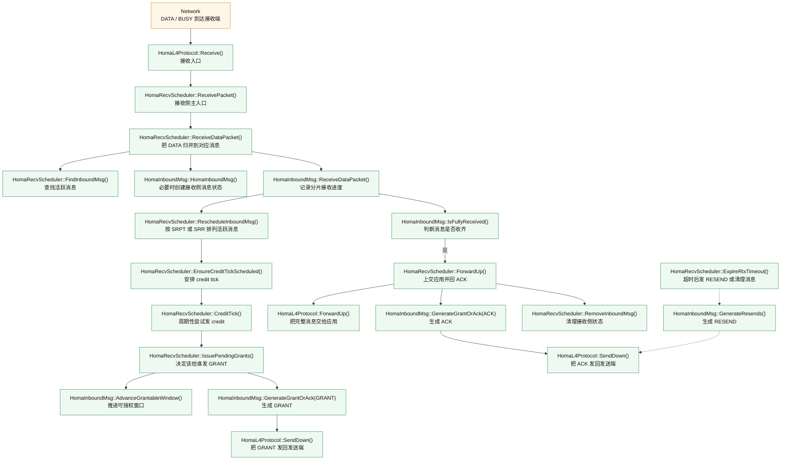

# Homa/SIRD 发送端与接收端函数调用图（精简版）

这份文档只保留最适合讲解的主函数调用链，不展开内部状态变量。

另见：

- [Homa/SIRD 发送端与接收端状态机图](./homa_send_recv_state_machine_zh.md)

特点：

- 只保留主路径
- 使用当前代码里的函数名
- 强调 `DATA`、`GRANT/ACK/RESEND` 和 `SIRD credit` 三条线

## 1. 发送端精简图

### 发送端怎么讲

1. `Send()` 接收完整 message。
2. `HomaOutboundMsg` 负责消息级状态，`HomaSendScheduler` 负责发送调度。
3. `TxDataPacket()` 是发送端持续运行的主循环。
4. `GetNextPacket()` 决定此刻发送的是：
   - 零负载 DATA credit request，还是
   - 真正的 DATA 分片。
5. 接收端返回的 `GRANT / RESEND / ACK` 会重新进入发送端控制路径。

## 2. 接收端精简图

### 接收端怎么讲

1. 所有 `DATA / BUSY` 先从 `Receive()` 进入接收端。
2. `ReceivePacket()` 一边处理普通 Homa 接收，一边驱动 SIRD credit 逻辑。
3. `ReceiveDataPacket()` 负责把 packet 归到某个 message 上。
4. `RescheduleInboundMsg()` 决定活跃消息顺序；`CreditTick()` 和 `IssuePendingGrants()` 决定何时把 credit 给谁。
5. 消息收齐后发 `ACK`；长期没有进展则 `ExpireRtxTimeout()` 触发 `RESEND`。

## 3. 最适合口头讲的 6 句话

1. 发送端先把完整 message 交给 `HomaL4Protocol::Send()`。
2. `HomaSendScheduler` 在 `TxDataPacket()` 里决定当前发哪条消息、哪一个分片。
3. 接收端收到 DATA 后，把分片归并到对应 `HomaInboundMsg`。
4. 接收端通过 `CreditTick()` 周期性触发调度，再由 `IssuePendingGrants()` 决定下一次把 credit 给谁。
5. 发送端收到 `GRANT` 后，在 `HandleGrantOffset()` 里推进授权窗口，再继续发 scheduled DATA。
6. 消息完成后，接收端回 `ACK`，发送端和接收端分别清理各自状态。

## 4. 引用建议

图名建议：

- `图 X Homa/SIRD 发送端主调用流程（精简版）`
- `图 Y Homa/SIRD 接收端主调用流程（精简版）`

正文一句话可以这样写：

> 图 X 和图 Y 展示了当前 Homa/SIRD 实现中发送端和接收端的主函数调用链。发送端围绕消息创建、发送调度和控制包处理展开；接收端围绕消息归并、credit 分配和完成确认展开。
