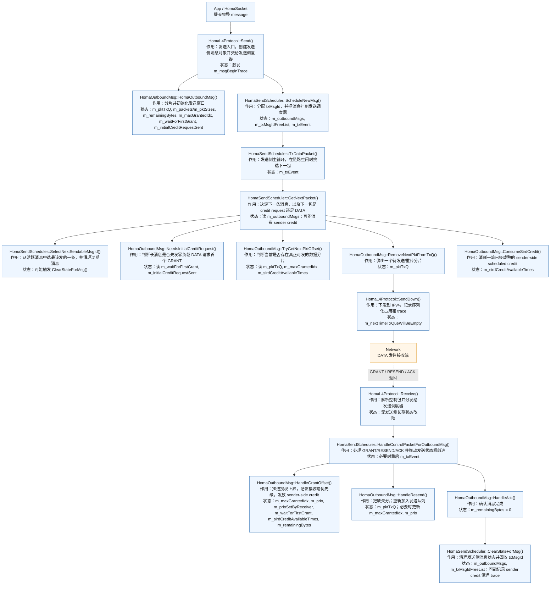
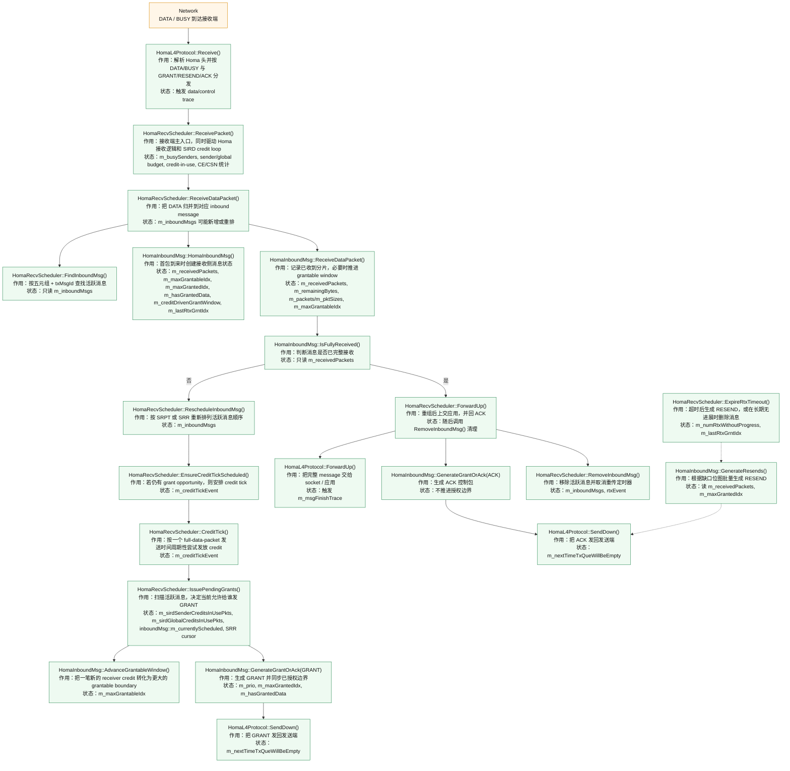

# Homa/SIRD 发送端与接收端函数调用图

这份文档按当前代码结构重写，和以下三个实现文件保持一致：

- `src/internet/model/homa-l4-protocol-core.cc`
- `src/internet/model/homa-l4-protocol-send.cc`
- `src/internet/model/homa-l4-protocol-recv.cc`

文档分成两张图：

- 发送端主流程
- 接收端主流程

每个节点统一给出三类信息：

- `函数名`
- `作用`
- `主要读写的长期状态`

## 1. 发送端主流程

### 发送端调用链说明

1. `HomaL4Protocol::Send()` 是应用层发送入口，只负责创建 `HomaOutboundMsg` 并把它交给 `HomaSendScheduler`。
2. `HomaOutboundMsg::HomaOutboundMsg()` 在消息级别完成初始化：分片、建立 `m_pktTxQ`、决定是否等待首个 `GRANT`。
3. `HomaSendScheduler::ScheduleNewMsg()` 给每条消息分配一个 `txMsgId`，随后由 `m_txEvent` 驱动 `TxDataPacket()` 进入包级发送循环。
4. `TxDataPacket()` 并不直接“自己挑包”，而是调用 `GetNextPacket()`。`GetNextPacket()` 再内部走两步：
   - `SelectNextSendableMsgId()`：从所有活跃消息里选最该发送的一条；
   - 对该消息调用 `NeedsInitialCreditRequest()` / `TryGetNextPktOffset()` / `RemoveNextPktFromTxQ()`。
5. 对长消息，第一步可能不是发送真实 payload，而是发送 `GenerateInitialCreditRequest()` 生成的零负载 DATA，请求接收端显式给第一笔 `GRANT`。
6. 一旦发出的是真实 DATA，SIRD 模式下会消耗一笔已经成熟的 sender-side credit，即 `ConsumeSirdCredit()`。
7. 控制包路径统一从 `HomaL4Protocol::Receive()` 进入发送调度器：
   - `GRANT` -> `HandleGrantOffset()`
   - `RESEND` -> `HandleGrantOffset()` + `HandleResend()`
   - `ACK` -> `HandleAck()` + `ClearStateForMsg()`
8. `HandleGrantOffset()` 是发送端最关键的状态推进点。它不仅推进 `m_maxGrantedIdx`，还把新增授权映射为 `m_sirdCreditAvailableTimes` 中未来可以真正起飞的 sender credit。

## 2. 接收端主流程

### 接收端调用链说明

1. `HomaL4Protocol::Receive()` 统一完成 Homa 头解析和分发：
   - `DATA/BUSY` 交给 `HomaRecvScheduler::ReceivePacket()`
   - `GRANT/RESEND/ACK` 交给发送端 `HomaSendScheduler`
2. `HomaRecvScheduler::ReceivePacket()` 不只是“收 DATA”。它还负责 SIRD 控制环：
   - 根据收到的 DATA 回收 credit
   - 更新每个 sender 的网络侧与主机侧预算
   - 维护 sender/global credit-in-use
   - 调度 `EnsureCreditTickScheduled()`
3. `ReceiveDataPacket()` 先尝试 `FindInboundMsg()`；如果找不到，说明这是该消息的首包，需要创建新的 `HomaInboundMsg`。
4. `HomaInboundMsg` 内部维护两条边界：
   - `m_maxGrantableIdx`：接收端当前“最多愿意放开到哪里”
   - `m_maxGrantedIdx`：已经通过 `GRANT` 真正告诉发送端“你可以发到哪里”
5. 消息未完成时，接收端并不会立刻 GRANT，而是先 `RescheduleInboundMsg()`，然后通过 `CreditTick()` -> `IssuePendingGrants()` 的闭环决定何时、给谁、发多少。
6. `IssuePendingGrants()` 是接收端 credit control 的核心：
   - 非 SIRD 模式：按 overcommit + busy sender 规则给 `GRANT`
   - SIRD 模式：同时受 sender budget、global budget、`m_sirdSenderCreditsInUsePkts`、`m_sirdGlobalCreditsInUsePkts` 限制
7. 消息完整后，`ForwardUp()` 会：
   - 调用 `HomaL4Protocol::ForwardUp()` 把重组结果交给应用
   - 发送 `ACK`
   - 调用 `RemoveInboundMsg()` 删除本地消息状态
8. 如果消息长期没有新的接收进展，`ExpireRtxTimeout()` 会生成 `RESEND`；如果超时次数过多，直接删除该消息状态。

## 3. 三条最重要的逻辑线

### 3.1 数据发送主线

`Send()` -> `ScheduleNewMsg()` -> `TxDataPacket()` -> `GetNextPacket()` -> `SendDown()`

这是“真正把 DATA 发出去”的主线。

### 3.2 授权控制主线

接收端：

`ReceivePacket()` -> `ReceiveDataPacket()` -> `RescheduleInboundMsg()` -> `EnsureCreditTickScheduled()` -> `CreditTick()` -> `IssuePendingGrants()` -> `GenerateGrantOrAck(GRANT)` -> `SendDown()`

发送端：

`Receive()` -> `HandleControlPacketForOutboundMsg()` -> `HandleGrantOffset()`

这是 receiver-driven Homa/SIRD 的核心闭环。

### 3.3 缺口恢复主线

接收端：

`ExpireRtxTimeout()` -> `GenerateResends()` -> `SendDown()`

发送端：

`Receive()` -> `HandleControlPacketForOutboundMsg()` -> `HandleResend()` -> `TxDataPacket()`

这是 “发现缺包 -> 请求重传 -> 重新发送” 的主线。

## 4. 论文或汇报里怎么引用

如果你想在正文里用一段话概括这两张图，可以直接写：

> 图 X 和图 Y 分别展示了当前 Homa/SIRD 实现中发送端与接收端的主函数调用链。发送端围绕 `HomaOutboundMsg` 与 `HomaSendScheduler` 展开，负责消息分片、授权窗口推进以及数据发送；接收端围绕 `HomaInboundMsg` 与 `HomaRecvScheduler` 展开，负责消息归并、credit 分配、GRANT/ACK 生成以及缺口恢复。

如果你口头讲图，建议只抓住三个词：

- `数据主线`
- `授权主线`
- `重传主线`

这样最容易讲清楚，不会陷进每个 helper 的细节里。
