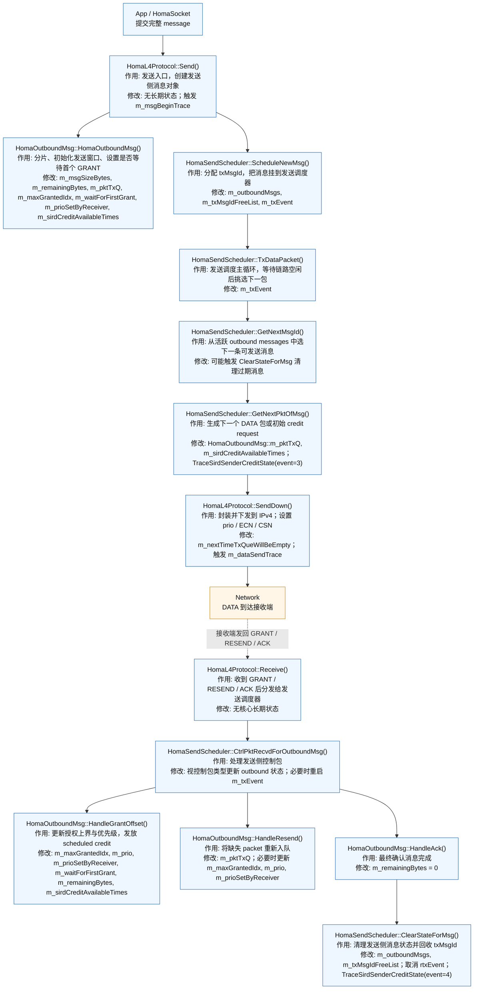
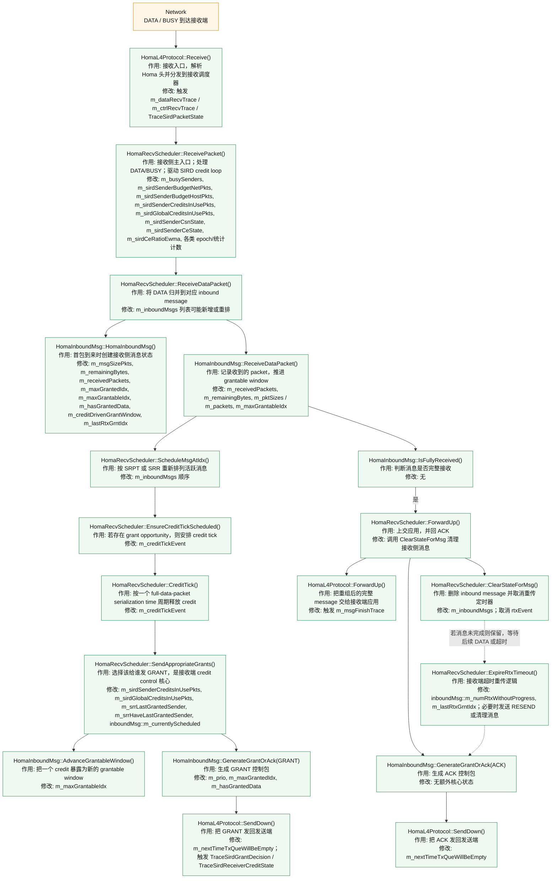

# Homa/SIRD 发送端与接收端函数调用图

这份文档给出两张函数调用图：

- 发送端主流程图
- 接收端主流程图

每个节点统一写三类信息：

- `函数名`
- `作用`
- `主要修改的状态量`

图中约定：

- 蓝色箭头：DATA 主路径
- 橙色箭头：GRANT / ACK / RESEND 控制路径
- 绿色虚线：SIRD credit / CE / CSN 控制逻辑

## 1. 发送端函数调用图

### 发送端图怎么读

1. 应用把一个完整 message 交给 `HomaL4Protocol::Send()`。
2. `Send()` 创建 `HomaOutboundMsg`，在这里完成分片、初始化 unscheduled/scheduled 发送窗口。
3. `ScheduleNewMsg()` 给消息分配 `txMsgId`，并挂到 `HomaSendScheduler::m_outboundMsgs`。
4. `TxDataPacket()` 是发送端主循环。它会先选消息，再选 packet，然后调用 `SendDown()` 发包。
5. 如果接收端发来 `GRANT/RESEND/ACK`，控制包会从 `Receive()` 进入 `CtrlPktRecvdForOutboundMsg()`。
6. `HandleGrantOffset()` 是发送端最关键的状态推进函数：它更新 `m_maxGrantedIdx` 和发送优先级，并把接收到的 scheduled credit 放进 `m_sirdCreditAvailableTimes`。
7. `HandleAck()` 后进入 `ClearStateForMsg()`，消息生命周期结束。

## 2. 接收端函数调用图

### 接收端图怎么读

1. 所有 `DATA/BUSY` 包先进入 `HomaL4Protocol::Receive()`，再进入 `HomaRecvScheduler::ReceivePacket()`。
2. `ReceivePacket()` 里有两层逻辑：
   - 普通 Homa 接收流程：把 DATA 交给 `ReceiveDataPacket()`。
   - SIRD 控制流程：读取 `CE/CSN`，回收 credit，更新 sender/global budget 和 credit-in-use 计数。
3. `HomaInboundMsg::ReceiveDataPacket()` 负责更新“这个 message 已经收到了哪些 packet”。
4. 接收端随后通过 `ScheduleMsgAtIdx()` 决定 active message 的顺序。`UseSrrScheduling=false` 时偏 SRPT；`true` 时偏 SRR/FIFO。
5. `CreditTick()` 和 `SendAppropriateGrants()` 构成 receiver-driven credit 核心闭环。
6. `SendAppropriateGrants()` 决定是否给某个 sender 发一个新的 GRANT，同时增加：
   - `m_sirdSenderCreditsInUsePkts[sender]`
   - `m_sirdGlobalCreditsInUsePkts`
7. 消息完整后，`ForwardUp()` 会把重组结果交给应用，再发 ACK，并清理 `HomaInboundMsg`。
8. 如果消息长时间没有进展，`ExpireRtxTimeout()` 会发 `RESEND` 或最终清理状态。

## 3. 论文里怎么用这两张图

建议把这两张图分别叫：

- `图 X 发送端 Homa/SIRD 函数调用流程`
- `图 Y 接收端 Homa/SIRD 函数调用流程`

正文中的一句话可以这样写：

> 图 X 和图 Y 分别展示了 Homa/SIRD 在发送端和接收端的主函数调用链。发送端流程围绕 `HomaOutboundMsg` 与 `HomaSendScheduler` 展开，负责消息分片、授权窗口推进和数据发送；接收端流程围绕 `HomaInboundMsg` 与 `HomaRecvScheduler` 展开，负责消息重组、GRANT 分配以及 SIRD credit control 状态更新。

如果你后面要，我可以继续把这两张 Mermaid 图整理成更适合论文排版的 `draw.io` 风格分层框图版本。
