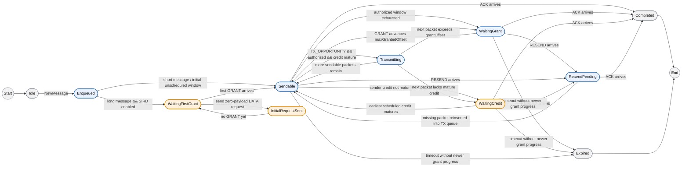

# Homa/SIRD 发送端与接收端状态机图

这份文档从“状态演化”的角度描述当前 Homa/SIRD 实现。

它和调用图的区别是：

- 调用图回答“谁调用了谁”
- 状态机图回答“消息在什么条件下进入下一个阶段”

如果你要写论文，这份图更适合说明：

- 长消息为什么要等待首个 `GRANT`
- `CreditTick` 为什么是接收端控制闭环的核心
- `ACK` 和 `RESEND` 分别在什么状态下触发

---

## 1. 发送端状态机

颜色约定：

- `蓝色`：原始 Homa 已有的主状态/主路径
- `橙色`：为 SIRD 新增，或在 SIRD 中被显著改造的状态/路径
- `灰色`：共同的起止与清理状态

### 发送端状态含义

- `Idle`：当前没有这条消息的状态。
- `Enqueued`：消息刚创建，已经完成分片并挂入发送调度器。
- `WaitingFirstGrant`：SIRD 长消息在发送真实 DATA 前，必须等待首个显式 `GRANT`。
- `InitialRequestSent`：已经发出零负载 DATA，请求接收端分配第一笔授权。
- `Sendable`：当前既有可发送分片，也满足授权边界和 credit 条件。
- `WaitingCredit`：授权已经到了，但 sender-side credit 还没成熟。
- `WaitingGrant`：本地还有数据，但接收端公布的 `grantOffset` 还不够大。
- `ResendPending`：接收到 `RESEND` 后，缺失分片被重新加入发送队列，等待再次发送。
- `Completed`：收到 `ACK`，消息生命周期结束。
- `Expired`：长时间没有新的授权进展，发送端将消息判定为失效并清理。

### 发送端图想表达什么

这张图最重要的结论有三个：

1. 对 SIRD 长消息来说，发送端不是“有数据就发”，而是要先经历：
   - `WaitingFirstGrant`
   - `InitialRequestSent`
   - `Sendable`
2. 对 scheduled DATA 来说，即使 `GRANT` 已经到了，也不一定能立刻发送；它还可能卡在 `WaitingCredit`。
3. 从颜色上看，原始 Homa 主要提供了 `Enqueued -> Sendable -> Transmitting / WaitingGrant -> Completed` 这条主线，而你新增的工作量主要体现在：
   - `WaitingFirstGrant`
   - `InitialRequestSent`
   - `WaitingCredit`
   这三类 SIRD 特有状态，以及与之对应的 credit request / credit maturity 转移。

---

## 2. 接收端状态机

颜色约定与发送端相同：

- `蓝色`：原始 Homa 已有的主状态/主路径
- `橙色`：为 SIRD 新增，或在 SIRD 中被显著改造的状态/路径
- `灰色`：共同的起止与清理状态

```mermaid
flowchart LR
    Start((Start)):::shared --> NoState([NoState]):::shared
    NoState -->|first DATA arrives| Active([Active]):::homa

    Active -->|message still incomplete| Reordered([Reordered]):::homa
    Reordered -->|active list updated| WaitingCreditTick([WaitingCreditTick]):::sird

    WaitingCreditTick -->|CreditTick && sender/global budget available| Granting([Granting]):::sird
    Granting -->|GRANT is sent| WaitingData([WaitingData]):::homa

    WaitingData -->|new DATA arrives, still incomplete| Reordered
    WaitingData -->|all packets received| DeliverAndAck([DeliverAndAck]):::homa
    Reordered -->|all packets received| DeliverAndAck
    DeliverAndAck -->|deliver upward + send ACK| Removed([Removed]):::shared

    WaitingData -->|RTX timeout && currentlyScheduled && sender not busy| ResendRecovery([ResendRecovery]):::homa
    ResendRecovery -->|RESEND packets generated and sent| WaitingData

    WaitingData -->|too many timeouts without progress| Removed
    Reordered -->|too many timeouts without progress| Removed

    Removed --> End((End)):::shared

    classDef homa fill:#eaf2ff,stroke:#2f6fb3,stroke-width:1.5px,color:#111;
    classDef sird fill:#fff0db,stroke:#d88900,stroke-width:1.5px,color:#111;
    classDef shared fill:#f2f2f2,stroke:#6b7280,stroke-width:1.2px,color:#111;
```

### 接收端状态含义

- `NoState`：接收端还没有这条消息的任何状态。
- `Active`：首个 DATA 到来后，已经为该消息建立 `HomaInboundMsg`。
- `Reordered`：收到新的 DATA 后，消息仍未完成，需要重新插回活跃列表。
- `WaitingCreditTick`：接收端已经知道这条消息存在，但真正是否给它发 `GRANT`，要等 `CreditTick` 决策。
- `Granting`：接收端本轮决定给该消息所属 sender 发放新的授权。
- `WaitingData`：已经给过 `GRANT`，现在等待新的 DATA 到来。
- `DeliverAndAck`：所有分片都已到达，接收端准备上交应用并回 `ACK`。
- `ResendRecovery`：等待已久仍未收到该到的数据，于是发送 `RESEND`。
- `Removed`：消息被正常完成清理，或者因长期无进展而删除。

### 接收端图想表达什么

这张图最重要的结论有三个：

1. 接收端不是“收到一个包就立刻发一个 `GRANT`”，中间还隔着：
   - 活跃消息重排
   - `CreditTick`
   - sender/global budget 检查
2. 在普通 Homa 中，DATA 到达自然推动下一轮授权；而在 SIRD 长消息中，真正控制节奏的是 `CreditTick`。
3. `RESEND` 不是随时都会发，只有消息处于“本轮确实被服务过、但迟迟没有进展”的状态时才进入恢复路径。
4. 从颜色上看，原始 Homa 已经包含了：
   - `Active`
   - `Reordered`
   - `WaitingData`
   - `DeliverAndAck`
   - `ResendRecovery`
   这些消息接收与恢复主线；而你新增或显著改造的工作量主要集中在：
   - `WaitingCreditTick`
   - `Granting`
   以及它们背后的 sender/global budget 检查和 token 化授权节拍控制。

---

## 3. 论文里如何描述这两张图

你可以直接写：

> 图 X 与图 Y 分别给出了发送端和接收端的状态机。图中蓝色状态表示原始 Homa 已有的主流程，橙色状态表示为支持 SIRD 新增或显著改造的控制阶段，灰色状态表示共同的起止与清理阶段。发送端状态机展示了消息从创建、等待首个授权、发送、等待 credit、重传恢复到完成的全过程；接收端状态机展示了消息从首包到达、活跃排序、credit tick 驱动授权、数据等待、重传恢复到完成清理的全过程。相比普通 Homa，SIRD 的关键差异在于：长消息的发送不再仅由授权边界决定，还受 sender-side credit maturity 与 receiver-side credit tick 共同控制。

---

## 4. 和当前代码的大致对应关系

发送端图主要对应：

- `HomaOutboundMsg::HomaOutboundMsg()`
- `NeedsInitialCreditRequest()`
- `GenerateInitialCreditRequest()`
- `TryGetNextPktOffset()`
- `HandleGrantOffset()`
- `HandleResend()`
- `HandleAck()`
- `ExpireRtxTimeout()`
- `HomaSendScheduler::TxDataPacket()`

接收端图主要对应：

- `HomaRecvScheduler::ReceivePacket()`
- `ReceiveDataPacket()`
- `RescheduleInboundMsg()`
- `EnsureCreditTickScheduled()`
- `CreditTick()`
- `IssuePendingGrants()`
- `ForwardUp()`
- `GenerateResends()`
- `ExpireRtxTimeout()`

---

## 5. 怎么和现有文档配合使用

建议这样搭配：

- 调用图：讲“函数调用链”
- 伪代码：讲“核心控制逻辑”
- 状态机图：讲“消息生命周期和状态转移”

如果你在汇报里只保留一张图来解释“为什么 SIRD 会改变行为”，优先保留这份状态机图。
