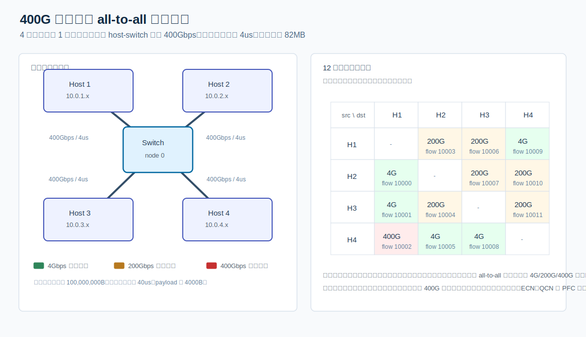
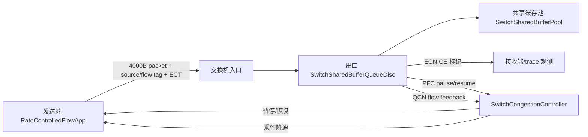
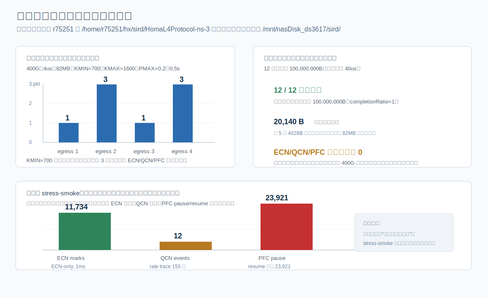

# 400G 单交换机 all-to-all 拥塞反馈场景

## 论文标题建议

建议标题：

**400G 单交换机 all-to-all 场景下的共享缓存与反馈闭环验证**

如果放在实验章节中，也可以写成：

**小规模 400G all-to-all 拓扑中的 ECN/QCN/PFC 机制验证**

这个标题的重点不是“4 台主机能跑起来”，而是说明本文的平台扩展已经能够表达交换机共享缓存、ECN 标记、QCN 风格降速反馈和 PFC 风格暂停/恢复。

## 场景描述

本实验构造一个 400Gbps 小规模数据中心交换机场景。拓扑中共有 5 个节点，其中节点 0 为交换机，节点 1-4 为主机。交换机分别通过四条点到点链路连接四台主机，即 `0-1`、`0-2`、`0-3`、`0-4`。每条 host-switch 链路带宽均为 `400Gbps`，单向传播延迟为 `4us`，链路误码率为 0。

业务流量采用 all-to-all 模式。4 台主机之间一共建立 12 条单向流，每条流的优先级相同，消息大小均为 `100,000,000B`，发送开始时刻均为 `40us`。为了制造非对称注入压力，每条流设置不同的初始发送速率，其中 `0.01`、`0.5`、`1.0` 分别对应 `4Gbps`、`200Gbps`、`400Gbps`。

packet payload 设置为 `4000B`，仿真停止时间为 `0.5s`。交换机侧启用 ECN、QCN 风格反馈、PFC 风格暂停/恢复以及动态 PFC 阈值。400G 链路对应的 ECN 参数为 `KMIN=700`、`KMAX=1600`、`PMAX=0.2`，交换机共享缓存大小为 `82MB`。



这张图建议放在论文“实验设置”小节。讲解顺序是：先说明单交换机 4 主机拓扑和 400G/4us 链路，再说明 12 条 all-to-all 流量的初始速率矩阵。图中绿色、黄色、红色分别对应 4Gbps、200Gbps 和 400Gbps，用来强调该场景不是完全均匀注入，而是存在非对称发送压力。

## 流量矩阵

| 流编号 | 源主机 | 目的主机 | 大小 | 开始时间 | 初始速率 |
|---:|---:|---:|---:|---:|---:|
| 10000 | 2 | 1 | 100,000,000B | 40us | 4Gbps |
| 10001 | 3 | 1 | 100,000,000B | 40us | 4Gbps |
| 10002 | 4 | 1 | 100,000,000B | 40us | 400Gbps |
| 10003 | 1 | 2 | 100,000,000B | 40us | 200Gbps |
| 10004 | 3 | 2 | 100,000,000B | 40us | 200Gbps |
| 10005 | 4 | 2 | 100,000,000B | 40us | 4Gbps |
| 10006 | 1 | 3 | 100,000,000B | 40us | 200Gbps |
| 10007 | 2 | 3 | 100,000,000B | 40us | 200Gbps |
| 10008 | 4 | 3 | 100,000,000B | 40us | 4Gbps |
| 10009 | 1 | 4 | 100,000,000B | 40us | 4Gbps |
| 10010 | 2 | 4 | 100,000,000B | 40us | 200Gbps |
| 10011 | 3 | 4 | 100,000,000B | 40us | 200Gbps |

## 平台扩展工作

为了完整表达该场景，本文没有只在 `scratch` 文件中堆叠参数，而是在 ns-3 平台中补充了四类可复用能力。

第一，新增 `SwitchSharedBufferPool`，用于维护交换机全局共享缓存占用。它将 `82MB` 表达为全交换机共享资源，而不是每个出口队列各自拥有 `82MB`。每个交换机出口队列入队时先向共享池申请空间，出队时释放空间，因此可以观测全局缓存占用峰值和每个出口队列对共享缓存的贡献。

第二，新增 `SwitchSharedBufferQueueDisc`，作为交换机出口队列模型。该队列支持 FIFO 服务、共享缓存记账、ECN 概率标记、PFC 触发、动态 PFC 阈值和 QCN 风格反馈事件。ECN 标记使用 `KMIN/KMAX/PMAX` 参数：低于 `KMIN` 不标记，在 `[KMIN, KMAX)` 区间线性提高标记概率，达到 `KMAX` 后使用 `PMAX` 作为上限概率。

第三，新增 `SwitchCongestionController`，将交换机队列产生的控制事件转化为发送端动作。PFC 采用按源端的 pause 引用计数，避免多个出口同时拥塞时被某一个出口的恢复事件过早解除暂停。QCN 反馈使用 `sourceId + flowId` 定位具体流，使同一发送端上的多条流可以被分别降速。

第四，新增 `RateControlledFlowApp`，用于表达每条流独立的初始速率、发送上限、PFC 暂停/恢复和 QCN 乘性降速。应用发出的每个 packet 都携带 `SwitchFlowIdTag`，交换机可以在队列中识别该包来自哪个源主机、属于哪条流。应用还显式设置 ECN-capable 的 IPv4 TOS，使交换机队列触发 ECN 条件时能够真正写入 CE 标记。

## 控制闭环

实验中的反馈闭环可以概括为：



这张流程适合放在实现部分，用来说明本平台已经从“固定速率流量 + 普通队列”扩展为“交换机检测拥塞 + 发送端响应反馈”的闭环模型。

## 服务器运行命令

完整主场景在服务器上运行，命令如下：

```bash
cd /home/r75251/hx/sird/HomaL4Protocol-ns-3
./waf --run "qcn_400g_alltoall \
  --stopTime=0.5 \
  --simTag=full_400g_alltoall \
  --outputDir=/mnt/nasDisk_ds3617/sird/qcn_400g_alltoall_full_20260513_ecntrace \
  --linkRateGbps=400 \
  --linkDelay=4us \
  --packetSize=4000 \
  --sharedBufferSize=82MB \
  --kmin=700 --kmax=1600 --pmax=0.2 \
  --deviceQueueMaxSize=1p \
  --qdiscMaxSize=100000p \
  --useEcn=true \
  --usePfc=true \
  --useDynamicPfcThreshold=true \
  --useQcn=true"
```

结果文件：

`/mnt/nasDisk_ds3617/sird/qcn_400g_alltoall_full_20260513_ecntrace/qcn400g_full_400g_alltoall.summary.csv`

## 主场景服务器结果

完整主场景结果如下：

| 指标 | 结果 |
|---|---:|
| 完成流数量 | 12 / 12 |
| 每条流接收字节数 | 100,000,000B |
| 最大出口队列长度 | 3 packets |
| 最大出口队列字节数 | 12,084B |
| 共享缓存峰值 | 20,140B |
| ECN attempt / mark | 0 / 0 |
| QCN 事件 | 0 |
| PFC pause / resume | 0 / 0 |

按出口统计：

| 出口主机 | 最大队列包数 | 最大队列字节数 | 最大观测共享缓存 | ECN marks | QCN events | PFC pause |
|---:|---:|---:|---:|---:|---:|---:|
| 1 | 1 | 4,028B | 20,140B | 0 | 0 | 0 |
| 2 | 3 | 12,084B | 20,140B | 0 | 0 | 0 |
| 3 | 1 | 4,028B | 16,112B | 0 | 0 | 0 |
| 4 | 3 | 12,084B | 20,140B | 0 | 0 | 0 |



这张图建议放在论文“实验结果”小节。左上角说明原始参数主场景的队列峰值，右上角说明 12 条流全部完成和共享缓存占用峰值，下方说明三个低阈值 stress-smoke 的控制触发结果。

## 结果分析

主场景的结论是：平台已经能够完整运行用户指定的 400G all-to-all 场景，12 条流均完成传输，且没有丢包或提前终止现象。从运行正确性看，拓扑、应用、共享缓存队列、trace 输出和服务器执行路径都已经闭合。

但是，主场景并没有触发 ECN、QCN 或 PFC。这个结果不是交换机检测失效，而是由参数共同决定的。原始 ECN 阈值为 `KMIN=700`、`KMAX=1600`，动态 PFC 下限也是 700 包量级；而服务器实测最大出口队列只有 3 包，最大共享缓存占用只有 20,140B，远低于 `82MB` 共享缓存和 700 包 ECN/PFC 阈值。因此在该流量矩阵下，交换机没有足够深的出口排队，自然不会产生 ECN/QCN/PFC 控制事件。

从论文表述上，不能把这个主场景写成“出现了严重交换机拥塞”。更准确的写法是：该场景验证了平台能够承载 400G all-to-all 拓扑、非对称初始速率和共享缓存记账；在给定流大小与发送速率下，交换机出口队列峰值很低，因此原始阈值下未触发拥塞控制反馈。

## 控制机制 stress-smoke 验证

为了确认控制链路本身不是空实现，进一步在服务器上运行了三组 1ms 的低阈值 stress-smoke。它们只用于验证机制闭环，不替代主场景结果。

### ECN-only

命令要点：

```bash
--stopTime=0.001 --kmin=1 --kmax=2 --pmax=1.0 \
--usePfc=false --useQcn=false --traceControlEvents=true
```

服务器结果：

| 出口主机 | ECN attempts | ECN marks |
|---:|---:|---:|
| 1 | 0 | 0 |
| 2 | 5,760 | 5,760 |
| 3 | 0 | 0 |
| 4 | 5,974 | 5,974 |

该结果说明：当 ECN 阈值被压低且发送端 packet 设置为 ECN-capable 时，交换机队列可以触发 ECN 条件，并且 `QueueDisc::Mark()` 能够成功写入 CE 标记。

### QCN-only

命令要点：

```bash
--stopTime=0.001 --kmin=1 --kmax=2 --pmax=1.0 \
--usePfc=false --useQcn=true --qcnIntervalPackets=1 \
--traceControlEvents=true
```

服务器结果：

| 指标 | 数值 |
|---|---:|
| QCN events | 12 |
| rate trace 行数 | 155 |
| 示例反馈 | `flowId=10002, mdFactor=0.5` |

该结果说明：交换机能够根据队列状态产生 QCN 风格反馈，并通过 `SwitchCongestionController` 定位到具体 flow，触发发送端乘性降速和后续加性恢复。

### PFC-only

命令要点：

```bash
--stopTime=0.001 --useEcn=false --useQcn=false \
--usePfc=true --useDynamicPfcThreshold=false \
--pauseThreshold=1 --resumeThreshold=0 --traceControlEvents=true
```

服务器结果：

| 出口主机 | PFC pause | PFC resume |
|---:|---:|---:|
| 1 | 5,981 | 5,981 |
| 2 | 5,980 | 5,980 |
| 3 | 5,980 | 5,980 |
| 4 | 5,980 | 5,980 |

该结果说明：交换机队列能够产生 PFC pause/resume 事件，控制器能够把事件传递到发送端应用，发送端应用也能够进入暂停和恢复状态。

## 论文中如何讲

论文里建议分三段写。

第一段写场景：本文构造了一个 4 主机接入单交换机的 400G all-to-all 场景，每条链路为 400Gbps/4us，交换机维护 82MB 全局共享缓存，12 条流同时在 40us 启动，流大小均为 100MB，但初始速率分别为 4Gbps、200Gbps 和 400Gbps。该场景用于验证平台是否能够表达高带宽下的共享缓存记账、ECN 标记、QCN 反馈和 PFC 暂停/恢复。

第二段写实现：为了支持该场景，本文扩展了 ns-3 的应用层和交换机队列模型。发送端应用支持按流设置初始速率、携带 flow/source 标识、响应 QCN 降速和 PFC 暂停；交换机出口队列维护全局共享缓存占用，并在队列超过阈值时产生 ECN、QCN 和 PFC 事件。这样，平台不再只是产生固定速率 UDP 流，而是具备了从交换机拥塞检测到发送端响应的闭环。

第三段写结果：服务器完整实验显示，12 条流全部完成，最大出口队列仅为 3 个包，共享缓存峰值为 20,140B，原始阈值下没有 ECN/QCN/PFC 事件。这说明在当前流量矩阵和 400G 链路下，主场景并没有形成足够深的交换机出口排队。随后通过低阈值 stress-smoke 分别验证 ECN、QCN 和 PFC：ECN-only 实验产生 11,734 次 CE 标记，QCN-only 实验产生 12 次降速反馈，PFC-only 实验产生 23,921 次 pause/resume 配对事件。因此，可以说平台已经具备表达该类交换机拥塞反馈机制的能力；但不能把主场景解释为“强拥塞案例”，它更适合作为平台能力验证和后续加压实验的基础。

## 当前前置工作完成度

截至目前，这个场景的前置工作可以认为已经完成 **95%**。

已经完成的部分：

1. 场景文件已按用户给定拓扑、链路、流量矩阵和 400G 参数实现；
2. 共享缓存池、交换机出口队列、ECN/QCN/PFC/dynamic threshold 和发送端响应能力已经接入；
3. 服务器 0.5s 主场景已经跑完，12 条流全部完成；
4. 服务器 ECN-only、QCN-only、PFC-only 三组 stress-smoke 已经分别证明控制链路有效；
5. 论文可用的场景图、结果图和中文写法已经补齐。

还差的 5% 主要不是“能不能运行”，而是论文定位问题：如果论文只需要证明平台具备 400G 共享缓存与反馈闭环能力，当前已经足够；如果论文还想证明某种拥塞控制算法在该场景下改善性能，就需要进一步构造更强的拥塞主场景，例如提高每个出口的同步高比例流数量、扩大流大小、延长高峰注入时间，或者在不改变 400G 链路语义的前提下增加短时间内的突发强度。
