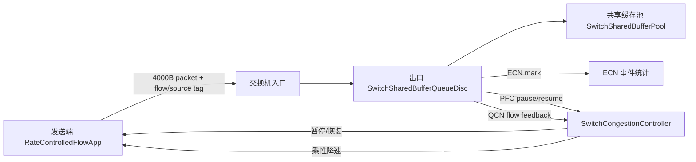

# 400G 单交换机 all-to-all 拥塞控制实验

## 实验标题建议

建议论文中使用标题：

**400G 单交换机 all-to-all 场景下的 ECN/QCN/PFC 反馈闭环验证**

如果放在“实验设计”一节中，也可以写成：

**小规模 400G all-to-all 拓扑中的交换机拥塞反馈机制验证**

这个标题比“4 台主机实验”更合适，因为它强调的是实验目的：验证平台是否能表达交换机共享缓存、ECN 标记、QCN 降速反馈和 PFC 暂停/恢复，而不是只验证一个拓扑能否跑起来。

## 场景描述

本实验构造一个 400Gbps 小规模数据中心交换机场景。拓扑中共有 5 个节点，其中节点 0 为交换机，节点 1-4 为主机。交换机分别通过四条点到点链路连接四台主机，即 `0-1`、`0-2`、`0-3`、`0-4`。每条链路的带宽均为 `400Gbps`，单向传播延迟为 `4us`，链路误码率设为 0。

业务流量采用 all-to-all 模式。4 台主机之间一共建立 12 条单向流，每条流的优先级相同，消息大小均为 `100,000,000B`，发送开始时刻均为 `40us`。为了制造非对称注入压力，每条流设置不同的初始发送速率，其中 `0.01`、`0.5`、`1.0` 分别对应 `4Gbps`、`200Gbps`、`400Gbps`。

实验中的 packet payload 设置为 `4000B`，仿真停止时间为 `0.5s`。交换机侧启用 ECN、QCN 风格反馈、PFC 风格暂停/恢复以及动态 PFC 阈值。400G 链路对应的 ECN 参数设置为 `KMIN=700`、`KMAX=1600`、`PMAX=0.2`，交换机共享缓存大小设置为 `82MB`。

## 流量矩阵

| 流编号 | 源主机 | 目的主机 | 大小 | 开始时间 | 初始速率 |
|---:|---:|---:|---:|---:|---:|
| 10000 | 2 | 1 | 100,000,000B | 40us | 4Gbps |
| 10001 | 3 | 1 | 100,000,000B | 40us | 4Gbps |
| 10002 | 4 | 1 | 100,000,000B | 40us | 400Gbps |
| 10003 | 1 | 2 | 100,000,000B | 40us | 200Gbps |
| 10004 | 3 | 2 | 100,000,000B | 40us | 200Gbps |
| 10005 | 4 | 2 | 100,000,000B | 40us | 4Gbps |
| 10006 | 1 | 3 | 100,000,000B | 40us | 200Gbps |
| 10007 | 2 | 3 | 100,000,000B | 40us | 200Gbps |
| 10008 | 4 | 3 | 100,000,000B | 40us | 4Gbps |
| 10009 | 1 | 4 | 100,000,000B | 40us | 4Gbps |
| 10010 | 2 | 4 | 100,000,000B | 40us | 200Gbps |
| 10011 | 3 | 4 | 100,000,000B | 40us | 200Gbps |

## 平台扩展工作

为了完整表达该场景，本次没有只在 `scratch` 中堆叠参数，而是在 ns-3 平台中增加了可复用能力。

首先，新增 `SwitchSharedBufferPool`，用于维护交换机全局共享缓存占用。它将 `82MB` 表达为全交换机共享资源，而不是错误地理解成每个出口队列各自拥有 `82MB`。每个交换机出口队列入队时先向共享池申请空间，出队时释放空间，因此可以观测全局缓存占用峰值和每个出口队列对共享缓存的贡献。

其次，新增 `SwitchSharedBufferQueueDisc`，作为交换机出口队列模型。该队列支持 FIFO 服务、共享缓存记账、ECN 概率标记、PFC 触发、动态 PFC 阈值和 QCN 风格反馈事件。ECN 标记使用 `KMIN/KMAX/PMAX` 参数：低于 `KMIN` 不标记，在 `[KMIN, KMAX)` 区间线性提高标记概率，达到 `KMAX` 后使用 `PMAX` 作为上限概率。

第三，新增 `SwitchCongestionController`，将交换机队列产生的事件转化为发送端动作。PFC 采用按源端的 pause 引用计数，避免多个出口同时拥塞时被某一个出口的恢复事件过早解除暂停。QCN 反馈使用 `sourceId + flowId` 定位具体流，使同一发送端上的多条流可以被分别降速。

第四，新增 `RateControlledFlowApp`，用于表达每条流独立的初始速率、发送上限、PFC 暂停/恢复和 QCN 乘性降速。应用发出的每个 packet 都携带 `SwitchFlowIdTag`，交换机可以在队列中识别该包来自哪个源主机、属于哪条流。

最后，新增 `scratch/qcn_400g_alltoall.cc`，专门装配该 400G all-to-all 场景。场景文件负责创建拓扑、安装交换机队列、配置 12 条流、连接 trace，并输出实验结果。

## 控制闭环

实验中的反馈闭环可以概括为：



这张图可以放在论文的实现部分，用来说明本平台已经从“固定速率流量 + 普通队列”扩展为“交换机检测拥塞 + 发送端响应反馈”的闭环模型。

## 输出文件说明

场景运行后会在输出目录生成以下文件：

| 文件 | 含义 | 论文用途 |
|---|---|---|
| `*.summary.csv` | 汇总配置、每条流收到的字节数、完成比例、每个出口的最大队列、ECN/QCN/PFC 计数、共享缓存峰值 | 最重要，适合直接整理成论文表格 |
| `*.flow-samples.tr` | 按时间采样每条流的发送字节、接收字节、当前速率和暂停状态 | 用于画每条流的速率/完成进度曲线 |
| `*.queue.tr` | 每次入队/出队时的出口队列状态，默认关闭逐事件输出 | 需要精细队列时间线时打开 |
| `*.shared-pool.tr` | 共享缓存每次变化的事件，默认关闭逐事件输出 | 需要精细缓存时间线时打开 |
| `*.ecn.tr` | ECN 标记事件，默认只在 summary 计数 | 用于说明核心拥塞信号是否触发 |
| `*.qcn.tr` | QCN 风格反馈事件，默认只在 summary 计数 | 用于说明发送端降速是否由交换机反馈驱动 |
| `*.pfc.tr` | PFC pause/resume 事件，默认只在 summary 计数 | 用于说明是否出现无损网络中的暂停/恢复 |
| `*.rate.tr` | 发送端速率变化事件 | 用于画 QCN 降速和 AI 恢复过程 |
| `*.app-pause.tr` | 发送端 pause/resume 状态变化 | 用于画 PFC 对发送端的影响 |

默认关闭逐包 queue/shared-pool trace，是为了避免 0.5s 的 400G 实验产生过大的 trace 文件。论文结果优先使用 `summary.csv` 和 `flow-samples.tr`；只有需要展示细粒度事件时，再通过命令行参数打开逐事件 trace。

## 运行命令

服务器 smoke：

```bash
cd /home/r75251/hx/sird/HomaL4Protocol-ns-3
./waf --run "qcn_400g_alltoall \
  --stopTime=0.001 \
  --simTag=server_smoke \
  --outputDir=/mnt/nasDisk_ds3617/sird/qcn_400g_alltoall_smoke"
```

服务器完整实验：

```bash
cd /home/r75251/hx/sird/HomaL4Protocol-ns-3
./waf --run "qcn_400g_alltoall \
  --stopTime=0.5 \
  --simTag=full_400g_alltoall \
  --outputDir=/mnt/nasDisk_ds3617/sird/qcn_400g_alltoall_full \
  --linkRateGbps=400 \
  --linkDelay=4us \
  --packetSize=4000 \
  --sharedBufferSize=82MB \
  --kmin=700 --kmax=1600 --pmax=0.2 \
  --deviceQueueMaxSize=1p \
  --qdiscMaxSize=100000p \
  --useEcn=true \
  --usePfc=true \
  --useDynamicPfcThreshold=true \
  --useQcn=true"
```

如果需要输出完整事件时间线，可以额外加：

```bash
--traceQueueEvents=true --tracePoolEvents=true --traceControlEvents=true
```

但完整 0.5s 实验不建议默认开启逐事件 trace。

## 论文中如何描述

论文可以先从场景动机讲起：在 400G 链路下，多个发送端同时向多个接收端注入大流，交换机出口可能出现瞬时排队和共享缓存占用。如果只用普通 FIFO 队列，很难同时分析 ECN 标记、PFC 暂停以及 QCN 降速对发送端行为的影响。因此本文构造了一个小规模但反馈闭环完整的 all-to-all 场景，用来验证平台是否能表达交换机侧拥塞检测与发送端响应。

随后描述实现：本文在 ns-3 中加入共享缓存池、交换机出口队列、拥塞控制器和速率受控发送应用。交换机出口队列负责维护 per-egress 队列和全局共享缓存占用，并根据 `KMIN/KMAX/PMAX` 执行 ECN 标记；当队列超过 PFC 阈值时，通过控制器暂停对应源端；当检测到拥塞时，通过 QCN 风格事件对具体 flow 执行乘性降速。发送端应用则根据 pause/resume 和 QCN 反馈改变自身发送行为。

最后描述结果：实验结果应报告每条流的接收字节数、完成比例、每个出口的最大队列长度、共享缓存峰值、ECN 标记次数、QCN 反馈次数和 PFC pause/resume 次数。如果完整实验中队列始终低于 `KMIN`，则说明该参数组合下 400G 链路与当前流量矩阵并没有形成足够强的交换机出口拥塞；如果出现 ECN/QCN/PFC 事件，则可以进一步用 `flow-samples.tr` 和 `rate.tr` 展示反馈如何影响发送端速率。

## 当前前置工作完成度

截至目前，前置工作已经完成了大约 **85%**：

1. 平台已具备共享缓存池；
2. 交换机出口队列已支持 ECN/QCN/PFC/dynamic threshold；
3. 发送端应用已支持不同初始速率、PFC pause/resume 和 QCN 乘性降速；
4. 场景文件已按 4 host、1 switch、12 flow、400G、4us、4000B、82MB、`KMIN=700/KMAX=1600/PMAX=0.2` 装配；
5. 本地 1ms smoke 已能构建并生成 summary 与流采样输出。

还需要完成的工作是：

1. 将代码同步到服务器工作区；
2. 在服务器跑 1ms smoke，确认 Linux 环境能编译运行；
3. 在服务器跑 0.5s 完整实验；
4. 根据服务器结果补充图表和最终结论。

在没有服务器完整结果之前，不能说“实验结论已经成立”；但可以说“场景前置能力基本补齐，已经进入服务器验证阶段”。
