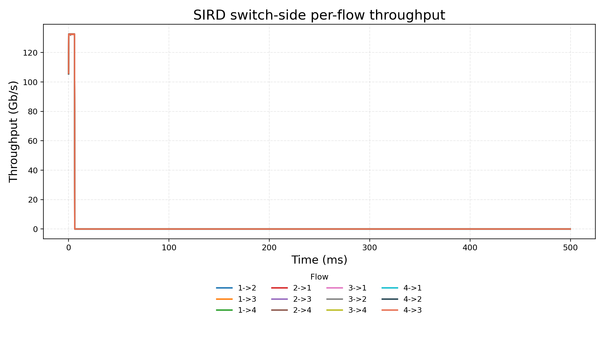
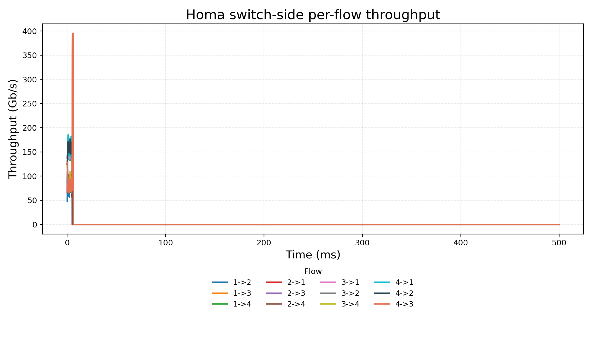
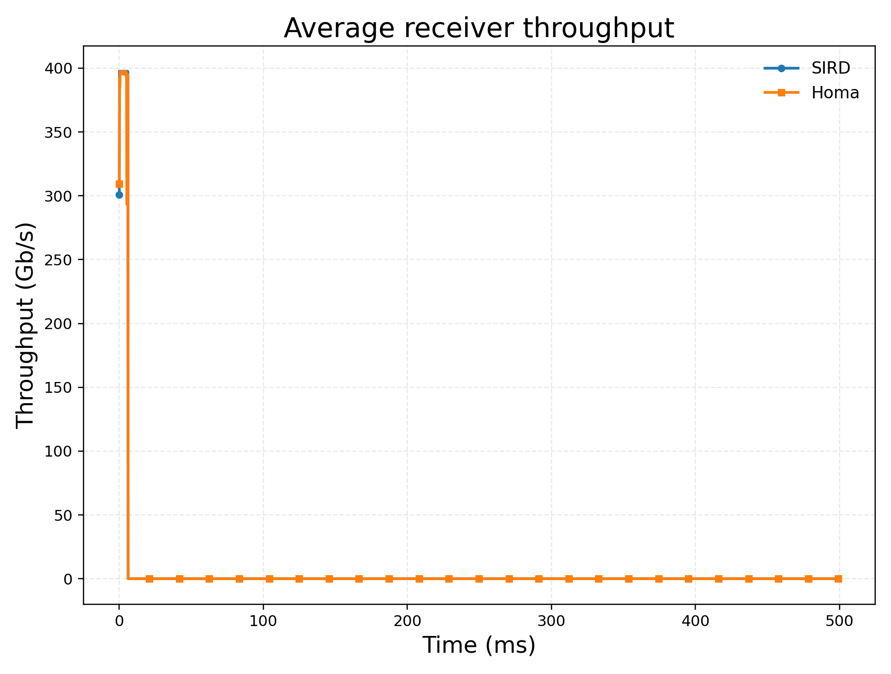

# 400G 单交换机 all-to-all：交换机侧逐流吞吐测量

## 场景目的

本实验聚焦于一个 4 台主机接入单交换机的 400G 小规模 all-to-all 场景。与此前按接收端统计平均吞吐不同，本实验的目标是从交换机视角观测每条流的吞吐曲线：交换机每个出端口在真正发送 Homa DATA 包时记录该包所属的 `srcHost -> dstHost`，再按固定时间窗口换算成该流的瞬时吞吐。

这个指标适合用来回答论文中的一个更具体的问题：当多个发送端和接收端同时通信时，SIRD/Homa 在交换机处看到的每条 flow 是否持续获得吞吐，是否出现某些 flow 长时间掉速，控制机制是否造成明显的利用率损失。

## 实验设置

拓扑包含 5 个节点，其中节点 0 是交换机，节点 1-4 是 host。交换机和每个 host 之间各有一条点到点链路：

| 链路 | 带宽 | 单向传播延迟 | 误码率 |
|---|---:|---:|---:|
| 0-1 | 400Gbps | 4us | 0 |
| 0-2 | 400Gbps | 4us | 0 |
| 0-3 | 400Gbps | 4us | 0 |
| 0-4 | 400Gbps | 4us | 0 |

业务采用 Homa/SIRD socket 路径，不配置 PFC/QCN。4 台 host 之间建立 12 条单向 all-to-all 消息流，每条消息大小为 `100,000,000B`，发送时刻均为 `40us`，packet payload 为 `4000B`，仿真停止时间为 `0.5s`。本次输出同时包含 SIRD 与原始 Homa 两组结果，便于对比。

运行命令在服务器执行，输出目录为：

```text
/mnt/nasDisk_ds3617/sird/sird_400g_alltoall_switch_flow_20260513
```

## 测量语义

本文新增的测量点不是接收端应用层回调，也不是 Homa 接收端 `DataPktArrival` trace，而是交换机侧 point-to-point netdevice 的出端口 `PhyTxBegin` trace。也就是说，只有当交换机已经从目标 host 对应的出端口开始发送该 packet 时，该 packet 才会被计入吞吐。

统计逻辑如下：

1. 在交换机连接四个 host 的四个出端口上连接 `PhyTxBegin`。
2. 对每个 packet 解析 `PPP -> IPv4 -> HomaHeader`。
3. 只统计 `HomaHeader::DATA` 且 `payloadSize > 0` 的数据包，GRANT、ACK、BUSY、RESEND 和零负载初始请求不计入吞吐。
4. 用 IPv4 源/目的地址映射出 `srcHost -> dstHost`。
5. 每 `100us` 输出一次每条 flow 在该窗口内的瞬时吞吐。

因此，图中的每条曲线表达的是“交换机出端口实际发送出去的该 flow 的 Homa DATA payload 吞吐”。这个定义比 receiver 聚合吞吐更适合分析逐流公平性和瞬时掉速。

## 输出文件

| 文件 | 含义 |
|---|---|
| `sird400g_sird.switch-flow-throughput.tr` | SIRD 下交换机侧逐流吞吐 trace |
| `sird400g_homa.switch-flow-throughput.tr` | Homa baseline 下交换机侧逐流吞吐 trace |
| `sird400g_sird.summary.csv` | SIRD 完成字节、接收字节、交换机发送字节汇总 |
| `sird400g_homa.summary.csv` | Homa 完成字节、接收字节、交换机发送字节汇总 |

trace 每行格式如下：

```text
<time_ns> series=<src->dst> srcHost=<src> dstHost=<dst> instGbps=<Gbps> totalBytes=<bytes>
```

例如 `series=4->1` 表示 host 4 发往 host 1 的 flow。

## 实验结果

两组实验都完成了 12 条消息流，每条 flow 在交换机侧观测到的 payload 总量均为 `100,000,000B`。

| 协议 | 目标总字节 | 接收端 DATA 字节 | 交换机侧 DATA 字节 | 完成消息 | 完成比例 |
|---|---:|---:|---:|---:|---:|
| SIRD | 1,200,000,000B | 1,200,000,000B | 1,200,000,000B | 12/12 | 100% |
| Homa | 1,200,000,000B | 1,200,000,000B | 1,200,000,000B | 12/12 | 100% |

需要注意，summary 中 `19.2Gbps` 是把 `1.2GB` 总数据量除以 `0.5s` 仿真总时长得到的全程平均 goodput。由于实际传输主要集中在前几个毫秒，论文中讨论吞吐曲线时不应使用这个全程平均值，而应该使用交换机侧窗口吞吐图。

## 图 1：SIRD 交换机侧逐流吞吐



这张图展示 SIRD 启用时交换机出端口观测到的 12 条 flow 吞吐。横轴为从第一个采样点开始计的时间，纵轴为每条 flow 在 `100us` 窗口内的瞬时吞吐。每条曲线对应一个 `srcHost -> dstHost`。

从图和统计结果看，SIRD 下 12 条 flow 的曲线几乎重合：所有 flow 从约 `0.14ms` 开始出现吞吐，在约 `6.14ms` 附近结束；每条 flow 的活跃期平均吞吐约为 `131.15Gbps`，峰值约为 `132.60Gbps`。这说明在当前 4-host all-to-all 场景中，SIRD 对各 flow 的发送进度控制较均匀，没有出现某一条 flow 被长期压低或长期空转的现象。

论文中可以这样讲这张图：SIRD 在交换机视角下呈现出较规则的逐流吞吐，12 条 flow 的完成时间和窗口吞吐基本一致，说明在该小规模对称 all-to-all 场景中，credit 调度没有引入明显逐流不公平。

## 图 2：Homa 交换机侧逐流吞吐



这张图展示关闭 SIRD 后原始 Homa baseline 的交换机侧逐流吞吐。Homa 同样完成了全部 12 条 flow，但不同 flow 的曲线差异更明显：部分 flow 在某些窗口出现接近 `395Gbps` 的高峰，部分 flow 的活跃期平均吞吐在 `129Gbps` 到 `157Gbps` 之间，结束时间约分布在 `5.14ms` 到 `6.24ms`。

论文中可以这样讲这张图：Homa baseline 仍然能够完成所有消息，但交换机侧逐流曲线更不均匀，表现为部分 flow 在短时间窗口内获得更高发送速率，而另一些 flow 的完成时间略晚。这说明 receiver-driven 调度在该场景中可以维持总体完成，但逐流瞬时吞吐比 SIRD 更波动。

## 图 3：接收端平均吞吐补充图



这张图是补充图，不是本文主指标。它按接收端 DATA 到达统计平均吞吐，用来和旧版本结果保持连续。由于它把四个 receiver 聚合后再平均，无法直接展示每条 flow 的差异，因此不建议作为本场景的主图。主文中应优先使用图 1 和图 2。

## 结果分析

本实验最重要的结论不是“全程平均 goodput 是 19.2Gbps”，而是“交换机出端口可以逐流观测到每条 Homa DATA flow 的瞬时吞吐”。从这个语义看，实验已经满足用户提出的目标：得到交换机测量的每条流吞吐曲线。

SIRD 的结果表现为 12 条 flow 几乎同步完成、活跃期吞吐接近一致。这说明在当前对称 all-to-all 场景中，SIRD 的 credit 控制没有造成某些 flow 被长期饿死，也没有出现明显的吞吐丢失。Homa baseline 也能完成所有流，但逐流吞吐更有波动，部分流出现接近单链路上限的短时峰值，说明 Homa 的瞬时调度更偏 bursty。

不过，这个场景仍然不是前面提到的“固定 SThr 不能适配动态网络”的最终问题场景。这里 12 条消息同时开始、大小相同、没有短流 burst 周期性占据某个 sender uplink，因此它主要验证交换机侧逐流测量能力和小规模 all-to-all 下的基本行为。若要证明“短流 burst 使某个 sender 的 per-sender bucket 被乘性降低，随后 additive increase 恢复过慢导致长期吞吐损失”，还需要构造一个包含长流和周期性短流 burst 的非平稳 workload。

## 论文写法建议

标题可以写成：

**交换机侧逐流吞吐观测：400G 单交换机 all-to-all 场景**

论文段落建议按下面顺序写：

第一段写场景：本文构造一个 4 台主机连接单交换机的 400G all-to-all 场景，每条 host-switch 链路为 `400Gbps/4us`，12 条 `100MB` Homa 消息在 `40us` 同时启动。该场景用于验证协议在小规模高带宽 all-to-all 通信下的逐流吞吐行为。

第二段写测量方法：为避免接收端聚合吞吐掩盖逐流差异，本文在交换机出端口 `PhyTxBegin` 处解析 `PPP/IPv4/Homa` 头，只统计 Homa DATA payload，并按 `srcHost -> dstHost` 每 `100us` 计算窗口吞吐。这样得到的曲线对应交换机实际发出的每条 flow 吞吐。

第三段写结果：实验显示 SIRD 与 Homa 均完成 12/12 条消息。SIRD 下 12 条 flow 的交换机侧吞吐曲线高度重合，活跃期平均吞吐约 `131Gbps`，完成时间约 `6.14ms`；Homa 下所有 flow 也完成，但逐流曲线更波动，部分 flow 出现接近 `395Gbps` 的短时峰值，完成时间在 `5.14-6.24ms` 之间。

第四段写结论：该实验说明当前平台已经能够从交换机视角输出逐流吞吐曲线，并能区分 SIRD 与 Homa 在瞬时调度行为上的差异。对于本文的最终动态 SThr 问题，该实验是测量能力验证；真正的问题复现还需要加入长流叠加周期性短流 burst 的动态 workload。
