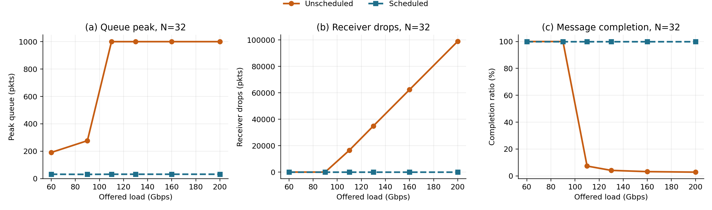
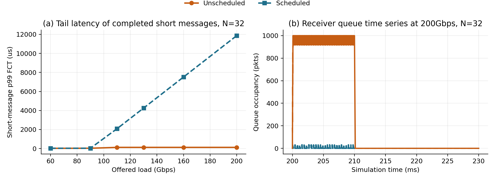

# 未调度短消息聚合过载场景写法

本文档用于把未调度短消息聚合过载实验写进论文或报告。它包含场景描述、问题定义、实验设置、结果表达、结论和写作注意事项。

## 1. 场景描述

本实验构造了一个多发送者到单接收者的短消息聚合场景。拓扑包含 `N` 个短消息发送端、一个可选的长流发送端、一个交换机和一个接收端。所有发送端都通过同一个交换机向同一个接收端发送流量，链路速率为 `100Gbps`，单段链路时延为 `1us`。

短消息大小设为 `8192B`。在默认 SIRD/Homa 配置下，该消息大小低于 unscheduled threshold，因此短消息可以不等待接收端 grant，直接以 unscheduled data 的形式发送。实验同时加入一条 `10MB` 的背景长流，用于观察短消息聚合过载对 scheduled traffic 的旁路影响。

这个场景刻意强调一种边界条件：receiver-driven credit 能够控制 scheduled data，但不能在短消息发送前控制已经被允许进入 unscheduled path 的数据。当许多发送端同时向同一个接收端发送低于阈值的短消息时，这些 unscheduled packets 会在接收端方向的交换机出口队列聚合。如果聚合速率超过接收端链路速率，receiver-facing queue 会快速增长，并在 lossy network 中产生 packet drop。

## 2. 要说明的问题

SIRD/Homa 的核心机制依赖接收端通过 grant/credit 控制 scheduled traffic，从而避免网络内部形成持久队列。然而，低于 unscheduled threshold 的短消息不需要等待 receiver credit。这个设计有利于小 RPC 的低延迟，但也带来一个潜在弱点：

> 当大量短消息同时发往同一个接收端时，unscheduled traffic 可能绕过 receiver-driven credit control，在接收端方向形成瞬时过载，导致队列溢出和丢包。

因此，本实验要回答的问题是：

1. 聚合 unscheduled short messages 是否会打满 receiver-facing queue？
2. 这种现象是否会导致 packet drop 和短消息完成率下降？
3. 如果把同样的短消息强制进入 scheduled path，是否能消除队列溢出？
4. 这种修复是否需要付出排队延迟增加的代价？

## 3. 实验设计

实验比较两种模式：

- `unsched`：使用正常 unscheduled threshold。`8192B` 短消息低于阈值，因此主要走 unscheduled path。
- `scheduled`：把 unscheduled threshold 降为 `1` packet，使同样的 `8192B` 短消息基本进入 scheduled path，作为 receiver-credit-controlled 对照组。

实验 sweep 参数如下：

```text
senders = 8, 16, 32
aggregate short-message load = 60, 90, 110, 130, 160, 200 Gbps
link rate = 100 Gbps
link delay = 1 us
short message size = 8192 B
long background flow = enabled, 10 MB, 17 Gbps
qdisc max size = 1000 packets
simulation duration = 5 ms
```

主要观测指标：

- receiver-facing queue peak；
- receiver-side packet drops；
- short-message completion ratio；
- short-message p99 FCT；
- background long-flow FCT。

结果来源为未调度短消息聚合过载 sweep 的汇总输出，正文写作时主要使用队列峰值、丢包和完成率指标。

## 4. 结果描述

### 4.1 Queue 和 drop

实验结果显示，`unsched` 模式在 `60Gbps` 和 `90Gbps` 下没有产生 drop，短消息全部完成。但从 `110Gbps` 开始，所有 sender 数量配置下的 receiver-facing queue 都达到 `1000p` 上限，并产生大量 packet drop。

相比之下，`scheduled` 模式在所有负载点和 sender 数量下都没有产生 receiver-side drop，receiver-facing queue peak 始终保持在很小范围内。

可以在论文中这样描述：

> 当 aggregate short-message load 不超过接收端链路容量时，unscheduled traffic 没有造成明显队列积压。然而，一旦 offered load 超过接收端 `100Gbps` 链路容量，unscheduled short messages 会迅速填满 receiver-facing queue。在 `110Gbps` 及更高负载下，`unsched` 模式的队列峰值均达到 `1000` packets，并伴随大量 packet drops。相同负载下，强制进入 scheduled path 的对照组没有出现队列溢出和丢包，说明 receiver credit 能够控制 scheduled traffic，但无法预先约束已进入 unscheduled path 的短消息。

关键结果：

| Senders | Load | Mode | Peak queue | Drops | Short completion |
|---:|---:|---|---:|---:|---:|
| 8 | 200Gbps | unsched | 1000p | 66472 | 14.15% |
| 16 | 200Gbps | unsched | 1000p | 98677 | 4.80% |
| 32 | 200Gbps | unsched | 1000p | 98946 | 2.82% |
| 8 | 200Gbps | scheduled | 8p | 0 | 100% |
| 16 | 200Gbps | scheduled | 16p | 0 | 100% |
| 32 | 200Gbps | scheduled | 32p | 0 | 100% |

### 4.2 Short-message completion ratio

在 `unsched` 模式下，短消息完成率随着负载升高明显下降。以 `200Gbps` 为例，`N=8` 时短消息完成率为 `14.15%`，`N=16` 时为 `4.80%`，`N=32` 时进一步下降到 `2.82%`。

这说明在 lossy network 中，unscheduled short-message overload 不只是造成临时排队，还会造成大量消息无法在仿真窗口内完成。这个现象符合预期：一旦 receiver-facing queue 溢出，后续短消息包会被 drop，短消息完成率会快速下降。

可以在论文中这样写：

> The loss behavior is reflected directly in message completion. At `200Gbps`, only `14.15%`, `4.80%`, and `2.82%` of short messages complete for `N=8`, `16`, and `32`, respectively. In contrast, all short messages complete in the scheduled baseline. This confirms that the observed queue buildup is not merely a transient buffering artifact; it translates into application-visible message loss or non-completion.

如果全文是中文，可以改写为：

> 丢包最终会反映到消息完成率上。在 `200Gbps` 负载下，`N=8/16/32` 的 `unsched` 模式短消息完成率分别只有 `14.15%`、`4.80%` 和 `2.82%`。而在 `scheduled` 对照组中，所有短消息均能完成。这说明 receiver-facing queue 的增长不是单纯的瞬时缓存现象，而会直接转化为应用可见的消息丢失或未完成。

### 4.3 FCT 结果的正确解释

需要特别注意：`unsched` 高负载下的 short-message p99 FCT 大约稳定在 `122us` 左右，但这个数字不能解释为 `unsched` 延迟更好。原因是大量短消息已经没有完成，FCT 统计只覆盖完成的消息，存在明显 survivor bias。

因此论文中不应该单独用 `unsched` 的 p99 FCT 证明其低延迟。正确表达应当是：

> Although the completed short messages in the unscheduled case show sub-millisecond FCT, this metric is biased by survival: most short messages are dropped or remain incomplete under overload. Therefore, completion ratio and receiver-side drops are the primary indicators for this experiment.

中文写法：

> 虽然 `unsched` 模式下已完成短消息的 p99 FCT 仍处在亚毫秒级，但该指标存在幸存者偏差，因为高负载下大部分短消息已经丢包或未完成。因此，本实验不能用已完成消息的 FCT 来说明 `unsched` 更优，而应主要依据 completion ratio、receiver-side drops 和 queue occupancy 判断系统行为。

### 4.4 Scheduled 对照组的代价

`scheduled` 模式完全消除了 receiver-facing queue buildup 和 drop，但代价是短消息延迟随着负载上升而明显增加。在 `200Gbps` 下，`scheduled` 模式的 short-message p99 FCT 约为 `12ms`。这说明把短消息强制进入 scheduled path 并不是免费的优化；它用 receiver-side control 换来了可靠完成和无丢包，但牺牲了短消息低延迟。

可以在论文中这样表达：

> The scheduled baseline eliminates receiver-side drops, but it does so by serializing short messages through the receiver credit path. As load increases, short-message latency rises substantially; at `200Gbps`, p99 FCT reaches about `12ms`. This highlights the tradeoff: unscheduled transmission improves low-load latency, while scheduled control prevents overload-induced loss at the cost of queueing delay.

中文写法：

> `scheduled` 对照组能够完全避免 receiver-facing queue 溢出和 packet drop，但它通过 receiver credit path 对短消息进行调度控制，因此高负载下短消息排队延迟显著增加。在 `200Gbps` 负载下，`scheduled` 模式的 short-message p99 FCT 约为 `12ms`。这体现了一个明确权衡：unscheduled path 有利于低负载短消息延迟，而 scheduled path 能避免过载丢包，但会引入更高排队延迟。

## 5. 图和读图说明

本节把适合论文正文展示的新版组合图放进文档，并说明每张图表达什么、能够支持什么结论。正文建议使用两张组合图：第一张展示队列峰值、丢包和完成率的过载转折；第二张展示高负载下 FCT 与队列时间序列，用于解释“幸存者偏差”和 scheduled path 的代价。

### 5.1 过载特征：队列峰值、丢包与完成率



这张图展示 `N=32` 时从 `60Gbps` 到 `200Gbps` 的负载扫描结果，包含三个子图：receiver-facing queue peak、receiver-side drops 和 short-message completion ratio。

图中的关键读法是：

- 在 `60Gbps` 和 `90Gbps` 下，未调度模式已经能够观察到有限但非零的瞬时排队，但 completion ratio 仍能保持在 `100%`；
- 一旦 offered load 超过 `100Gbps`，未调度模式的 queue peak 迅速达到 `1000` packets 上限；
- 队列触顶后会进一步产生大量 receiver-side drops；
- completion ratio 随之快速下降，在 `200Gbps` 下只剩约 `2.82%`；
- 调度对照组在整个负载区间内保持 `100%` 完成率，说明 receiver credit 对 scheduled traffic 的约束仍然有效。

这张图能说明：未调度短消息在低负载下可以保持快速启动，但当多个发送端同时向同一接收端聚合、且 offered load 超过接收端链路容量时，未调度路径会绕过 receiver credit 并造成接收端方向队列触顶、丢包和完成率崩塌。

论文图注可以写：

> 未调度短消息聚合过载场景在 `N=32` 下的过载转折。超过 `100Gbps` 接收端链路容量后，未调度模式的 receiver-facing queue 迅速触顶并产生大量丢包，短消息完成率急剧下降；调度对照组保持 `100%` 完成率。

### 5.2 高负载时延与队列时序



这张图用于解释 FCT 指标的正确读法。左图展示 `N=32` 下已完成短消息的 p99 FCT，右图展示 `200Gbps` 高负载下 receiver-facing queue 的时间序列。

图中的关键读法是：

- 未调度模式在高负载下的 p99 FCT 仍可能维持在约 `122us`；
- 但该 FCT 只统计幸存完成的少量短消息，不能代表整体性能；
- 调度对照组在高负载下 p99 FCT 明显增大，`200Gbps` 下约为 `12ms`；
- 右图显示未调度模式的 receiver-facing queue 在高负载下长期处于触顶状态，而调度对照组把队列限制在很小范围内。

因此，这张图不能用来证明未调度模式在高负载下“时延更好”。正确解释是：未调度模式的低 FCT 存在明显幸存者偏差；调度对照组牺牲短消息排队时延，换来了零丢包和 `100%` 完成率。

论文图注可以写：

> 未调度短消息聚合过载场景在 `N=32` 下的高负载时延与队列时序。未调度模式的已完成消息 FCT 存在幸存者偏差；调度对照组虽然增加排队时延，但能够避免队列溢出和丢包。

### 5.3 推荐图组合

如果论文空间有限，建议只放上述两张图：

1. `figure_4_1_unscheduled_short_queue_drops_completion.png`
   - 证明未调度短消息聚合超过接收端容量后会造成 queue peak 触顶、packet drop 和 completion ratio 下降。

2. `figure_4_2_unscheduled_short_latency_queue.png`
   - 说明 FCT 的幸存者偏差，并展示 scheduled path 的代价与队列控制效果。

旧的单独 queue peak、drops、FCT 和 queue time-series 图可以作为补充材料；正文中使用组合图更节省篇幅，也更容易把“现象-后果-机制解释”放在一起讲清楚。

## 6. 可以直接使用的论文段落

### 中文版本

我们进一步构造了一个未调度短消息聚合过载场景，用于分析 receiver-driven credit 在短消息路径上的边界条件。该场景包含多个发送端和一个接收端，所有发送端通过同一个交换机向同一接收端发送 `8192B` 短消息。由于该消息大小低于默认 unscheduled threshold，短消息可以不等待接收端 grant 而直接发送。我们同时加入一条 `10MB` 背景长流，以观察短消息聚合过载对 scheduled traffic 的影响。

实验比较两种配置：`unsched` 使用默认 unscheduled threshold，使 `8192B` 短消息走 unscheduled path；`scheduled` 将 unscheduled threshold 降至 `1` packet，使相同短消息基本进入 receiver-credit-controlled scheduled path。我们 sweep 发送端数量 `N=8,16,32`，以及聚合短消息负载 `60-200Gbps`。

结果显示，当聚合短消息负载不超过接收端 `100Gbps` 链路容量时，`unsched` 模式没有产生明显丢包。但从 `110Gbps` 开始，`unsched` 模式在所有发送端数量下都将 receiver-facing queue 打满到 `1000` packets，并产生大量 packet drops。在 `200Gbps` 负载下，`N=8/16/32` 的 `unsched` 短消息完成率分别只有 `14.15%`、`4.80%` 和 `2.82%`。相比之下，`scheduled` 对照组在所有负载下都没有出现 receiver-side drop，短消息完成率保持 `100%`。

这一结果说明，SIRD/Homa 的 receiver-driven credit 能够有效控制 scheduled data，但无法在发送前约束已经进入 unscheduled path 的短消息。当大量低于阈值的短消息同时发往同一个接收端时，它们会在 receiver-facing egress queue 聚合，导致队列溢出和 packet drop。另一方面，强制短消息进入 scheduled path 可以避免该问题，但会显著增加高负载下的短消息排队延迟；在 `200Gbps` 负载下，`scheduled` 的 short-message p99 FCT 约为 `12ms`。因此，该实验揭示了 unscheduled path 的低延迟收益与过载保护能力之间的权衡。

### English version, if needed

We construct an unscheduled short-message overload scenario to expose a boundary condition of receiver-driven credit control. The topology consists of multiple senders and one receiver connected through a single switch. Each sender transmits `8192B` short messages to the same receiver. Since these messages are below the default unscheduled threshold, they can be sent without waiting for receiver grants. A `10MB` background long flow is also enabled to observe collateral effects on scheduled traffic.

We compare two configurations. In `unsched`, the default unscheduled threshold is used, so the `8192B` messages mostly follow the unscheduled path. In `scheduled`, the unscheduled threshold is reduced to one packet, forcing the same messages into the receiver-credit-controlled scheduled path. We sweep the number of short-message senders (`N=8,16,32`) and the aggregate offered load (`60-200Gbps`).

The results show that the unscheduled path behaves well below the receiver link capacity, but fails sharply once the aggregate short-message load exceeds `100Gbps`. Starting from `110Gbps`, the receiver-facing queue reaches the `1000`-packet limit in all sender configurations and incurs substantial packet drops. At `200Gbps`, only `14.15%`, `4.80%`, and `2.82%` of short messages complete for `N=8`, `16`, and `32`, respectively. In contrast, the scheduled baseline has zero receiver-side drops and completes all short messages across all tested loads.

These results show that receiver-driven credit effectively controls scheduled data, but cannot pre-control short messages that are already admitted into the unscheduled path. Aggregated unscheduled traffic can therefore overflow the receiver-facing queue in a lossy network. Forcing short messages into the scheduled path avoids drops, but increases queueing delay; at `200Gbps`, scheduled short-message p99 FCT reaches about `12ms`. The experiment highlights the tradeoff between low-latency unscheduled transmission and overload protection.

## 7. 结论写法

可以把结论写成以下三点：

1. SIRD/Homa 的 receiver-driven credit 对 scheduled traffic 有效，但它不控制已进入 unscheduled path 的短消息。

2. 在多发送者单接收者场景中，低于 unscheduled threshold 的短消息会在 receiver-facing queue 聚合。当 aggregate offered load 超过接收端链路容量时，该队列会被打满并产生 packet drop。

3. 将短消息强制纳入 scheduled path 可以消除该丢包问题，但代价是高负载下短消息 FCT 显著增加。因此，unscheduled threshold 的选择本质上是在低负载延迟和过载保护之间折中。

## 8. 写作注意事项

- 不要把该实验表述为“SIRD 整体失效”。更准确的说法是：该实验揭示了 unscheduled path 在多发送者聚合短消息下的边界条件。
- 不要用 `unsched` 高负载下完成消息的 p99 FCT 说明其延迟更好，因为该指标存在 survivor bias。
- 应把 completion ratio、receiver-side drops 和 receiver-facing queue peak 作为主指标。
- `scheduled` 不是替代协议，而是一个对照组，用于说明 receiver credit 控制可以避免该类 receiver-side overflow。
- 如果论文空间有限，优先展示两张新版组合图：`figure_4_1_unscheduled_short_queue_drops_completion.png` 和 `figure_4_2_unscheduled_short_latency_queue.png`。
